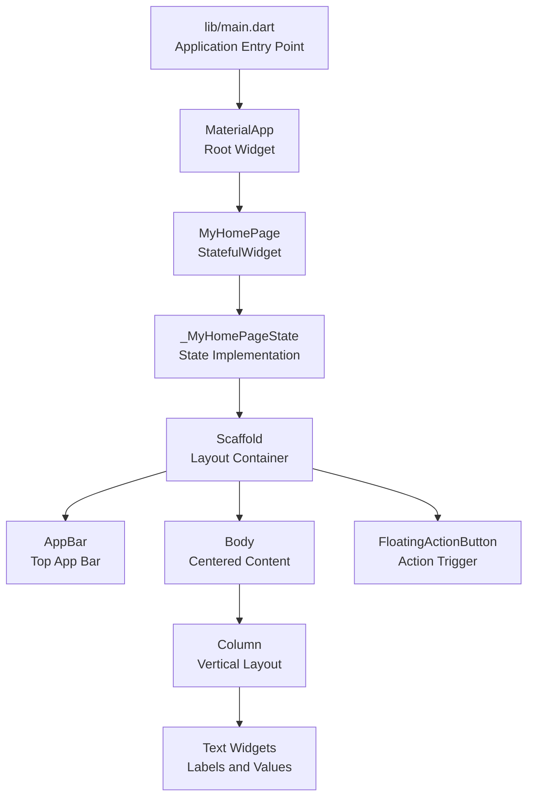
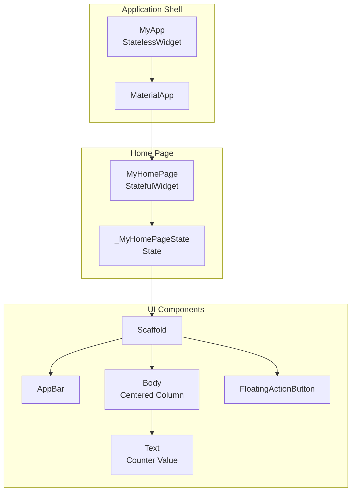
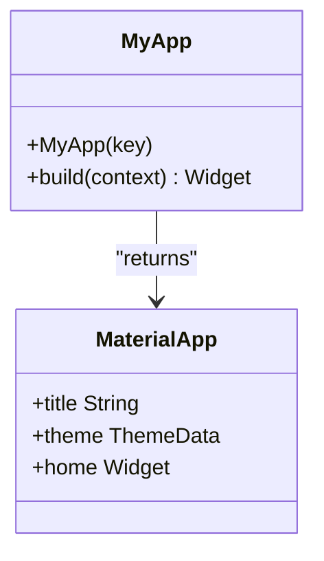
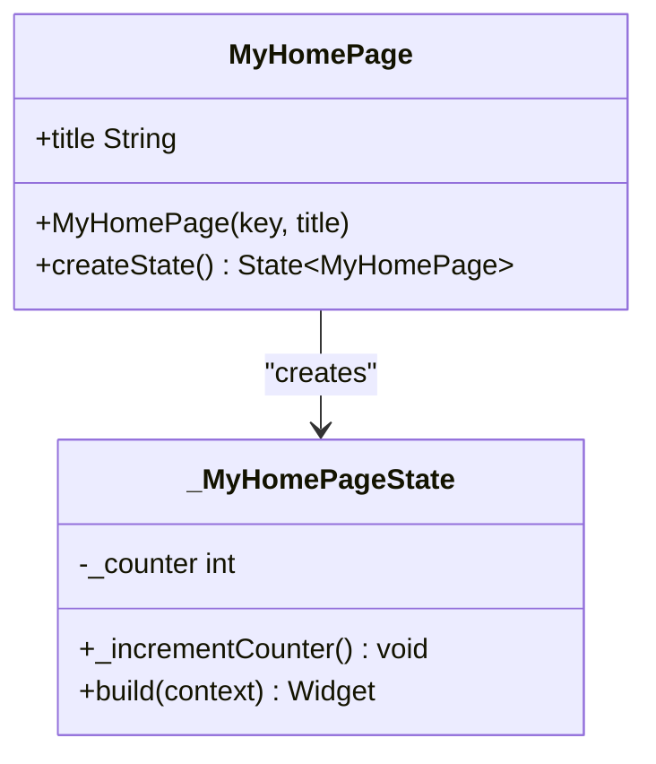
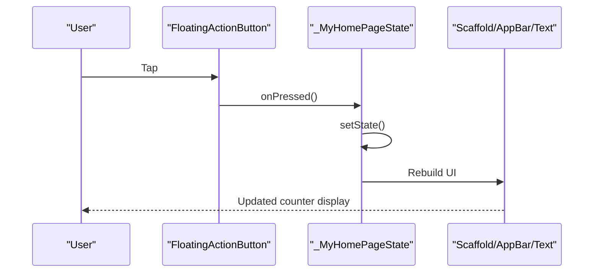
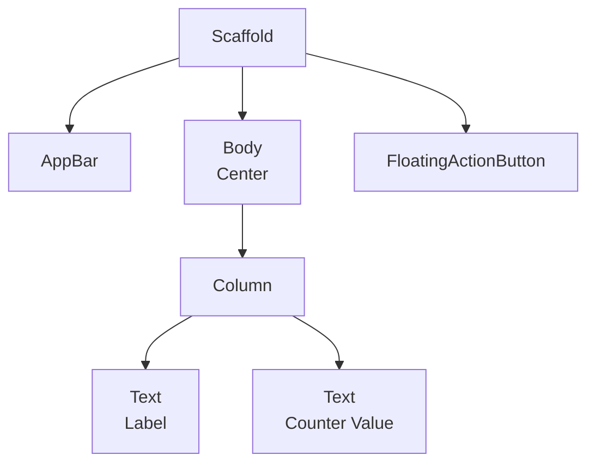
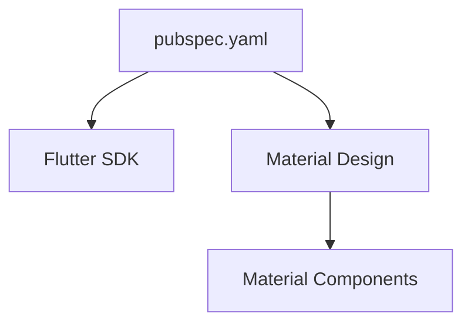

# API Reference

<cite>
**Referenced Files in This Document**
- [main.dart](file://lib/main.dart)
- [widget_test.dart](file://test/widget_test.dart)
- [pubspec.yaml](file://pubspec.yaml)
- [README.md](file://README.md)
</cite>

## Table of Contents
1. [Introduction](#introduction)
2. [Project Structure](#project-structure)
3. [Core Components](#core-components)
4. [Architecture Overview](#architecture-overview)
5. [Detailed Component Analysis](#detailed-component-analysis)
6. [Dependency Analysis](#dependency-analysis)
7. [Performance Considerations](#performance-considerations)
8. [Troubleshooting Guide](#troubleshooting-guide)
9. [Conclusion](#conclusion)

## Introduction
This document provides API documentation for the Flutter employee attendance tracking application’s public interfaces and components. It focuses on the application entry point and the primary UI components that demonstrate Material Design integration and state management patterns. The documentation covers:
- The application entry point and top-level widget
- The home page widget and its stateful implementation
- Material Design components used in the UI
- Parameter specifications, return values, and usage examples
- Integration patterns for building an attendance tracking interface

The application is a minimal demonstration of Flutter fundamentals and Material Design, suitable as a foundation for an attendance tracking interface.

**Section sources**
- [README.md:1-17](file://README.md#L1-L17)

## Project Structure
The project follows a standard Flutter structure with the application entry point in lib/main.dart, tests in test/widget_test.dart, and project metadata in pubspec.yaml. The main application logic resides in lib/main.dart, which defines the MyApp StatelessWidget and the MyHomePage StatefulWidget with its internal state class _MyHomePageState.

**Diagram sources**
- [main.dart:3-122](file://lib/main.dart#L3-L122)

**Section sources**
- [main.dart:1-123](file://lib/main.dart#L1-L123)
- [pubspec.yaml:1-90](file://pubspec.yaml#L1-L90)

## Core Components
This section documents the public interfaces and their responsibilities.

- MyApp (StatelessWidget)
  - Purpose: Root widget that configures the application shell and theme.
  - Constructor parameters:
    - key: A key used to uniquely identify the widget instance.
  - Build method:
    - Parameters: BuildContext context
    - Returns: A MaterialApp widget configured with a theme and a home page.
  - Usage example: Run the application by passing an instance of MyApp to runApp.

- MyHomePage (StatefulWidget)
  - Purpose: The home page of the application, which manages stateful UI.
  - Constructor parameters:
    - key: A key used to uniquely identify the widget instance.
    - title: A required String used to set the AppBar title.
  - State creation:
    - Returns: An instance of _MyHomePageState.
  - Usage example: Instantiate with a title and pass as the home property of MaterialApp.

- _MyHomePageState (State<MyHomePage>)
  - Purpose: Manages the state of the home page, including the counter and UI rendering.
  - State fields:
    - _counter: An integer representing the number of button presses.
  - Methods:
    - _incrementCounter(): Increments the counter and triggers a UI rebuild.
    - build(context): Renders the Scaffold, AppBar, body content, and FloatingActionButton.
  - Usage example: Call _incrementCounter() in response to user actions to update the UI.

**Section sources**
- [main.dart:7-54](file://lib/main.dart#L7-L54)
- [main.dart:56-122](file://lib/main.dart#L56-L122)

## Architecture Overview
The application architecture centers around a single-page design using Material Design components. The MyApp widget configures the application theme and sets the home page. The MyHomePage widget encapsulates stateful behavior, and its state class renders the UI using Scaffold, AppBar, Column, Text, and FloatingActionButton.

**Diagram sources**
- [main.dart:7-122](file://lib/main.dart#L7-L122)

## Detailed Component Analysis

### MyApp StatelessWidget
- Constructor
  - Parameters: key (WidgetKey)
  - Behavior: Initializes the widget with a key.
- Build Method
  - Parameters: BuildContext context
  - Returns: MaterialApp configured with:
    - title: A descriptive application title.
    - theme: ThemeData derived from a color seed.
    - home: An instance of MyHomePage initialized with a title.
- Usage
  - Typical usage: Pass an instance of MyApp to runApp to start the application.

**Diagram sources**
- [main.dart:7-36](file://lib/main.dart#L7-L36)

**Section sources**
- [main.dart:7-36](file://lib/main.dart#L7-L36)

### MyHomePage StatefulWidget
- Constructor
  - Parameters: key (WidgetKey), title (String, required)
  - Behavior: Stores the title for later use in the AppBar.
- createState
  - Returns: A new instance of _MyHomePageState.
- Usage
  - Typical usage: Instantiate with a title and assign as the home property of MaterialApp.

**Diagram sources**
- [main.dart:38-54](file://lib/main.dart#L38-L54)

**Section sources**
- [main.dart:38-54](file://lib/main.dart#L38-L54)

### _MyHomePageState Class
- State Fields
  - _counter: Tracks the number of button presses.
- Methods
  - _incrementCounter()
    - Parameters: None
    - Returns: void
    - Behavior: Updates the internal counter and triggers a UI rebuild via setState.
  - build(context)
    - Parameters: BuildContext context
    - Returns: A Scaffold widget containing:
      - AppBar with a themed background and title text.
      - Centered body with a Column layout displaying a label and the current counter value.
      - A FloatingActionButton that triggers _incrementCounter on press.
- Usage
  - Typical usage: Render the stateful UI by returning the Scaffold from build, and connect the FloatingActionButton’s onPressed callback to _incrementCounter.

**Diagram sources**
- [main.dart:56-122](file://lib/main.dart#L56-L122)

**Section sources**
- [main.dart:56-122](file://lib/main.dart#L56-L122)

### Material Design Components
- AppBar
  - Purpose: Provides a top app bar with a themed background and title.
  - Key properties:
    - backgroundColor: Derived from the current theme’s inverse primary color.
    - title: A Text widget displaying the page title.
  - Usage: Included within Scaffold to define the header area.

- Scaffold
  - Purpose: Provides the scaffold layout with app bar, body, and floating action button areas.
  - Key properties:
    - appBar: The AppBar instance.
    - body: Centered content using a Column layout.
    - floatingActionButton: A button that triggers state updates.
  - Usage: Wraps the entire page content for consistent Material Design layout.

- FloatingActionButton
  - Purpose: Presents a prominent action button for user interaction.
  - Key properties:
    - onPressed: Callback invoked when tapped.
    - tooltip: A string describing the action.
    - child: An icon representing the action.
  - Usage: Integrated with the state’s increment method to update the UI.

- Text
  - Purpose: Displays static and dynamic text content.
  - Key properties:
    - Static text for labels.
    - Dynamic text bound to the current counter value.
    - style: Uses the current theme’s headlineMedium text style.
  - Usage: Used for labels and values within the body layout.

**Diagram sources**
- [main.dart:78-120](file://lib/main.dart#L78-L120)

**Section sources**
- [main.dart:78-120](file://lib/main.dart#L78-L120)

### Attendance Tracking Integration Patterns
While the current implementation demonstrates a counter, the same patterns can be adapted for attendance tracking:
- Replace the counter with attendance records and status indicators.
- Use the AppBar title to reflect the current screen (e.g., “Attendance Dashboard”).
- Integrate the body content with lists of employees, check-in/out buttons, and summaries.
- Connect the FloatingActionButton to actions such as marking attendance or navigating to a detailed view.

[No sources needed since this section provides conceptual integration guidance]

## Dependency Analysis
The application depends on the Flutter SDK and Material Design components. The pubspec.yaml declares the Flutter SDK version and enables Material Design usage.

**Diagram sources**
- [pubspec.yaml:21-58](file://pubspec.yaml#L21-L58)

**Section sources**
- [pubspec.yaml:21-58](file://pubspec.yaml#L21-L58)

## Performance Considerations
- Efficient rebuilds: The stateful widget rebuilds only the necessary parts of the UI when setState is called, minimizing unnecessary work.
- Theme-driven styling: Using Theme.of(context) ensures consistent styling and reduces manual color management overhead.
- Minimal state: Keeping state local to the widget avoids unnecessary prop drilling and simplifies updates.

[No sources needed since this section provides general guidance]

## Troubleshooting Guide
- Test coverage: The widget test verifies initial state and the effect of pressing the FloatingActionButton.
  - Smoke test checks that the counter starts at zero and increments after tapping the add icon.
  - Use this pattern to validate attendance-related UI updates.

**Section sources**
- [widget_test.dart:13-30](file://test/widget_test.dart#L13-L30)

## Conclusion
This API reference documented the application’s core components and Material Design integration. The MyApp StatelessWidget configures the application shell, while MyHomePage and _MyHomePageState manage the home page UI and state. The documented patterns provide a foundation for integrating attendance tracking features, including replacing the counter with attendance data and connecting actions to attendance operations.

[No sources needed since this section summarizes without analyzing specific files]