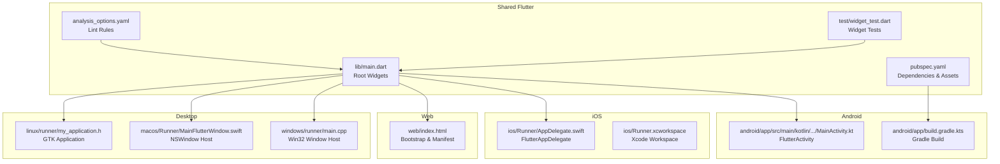
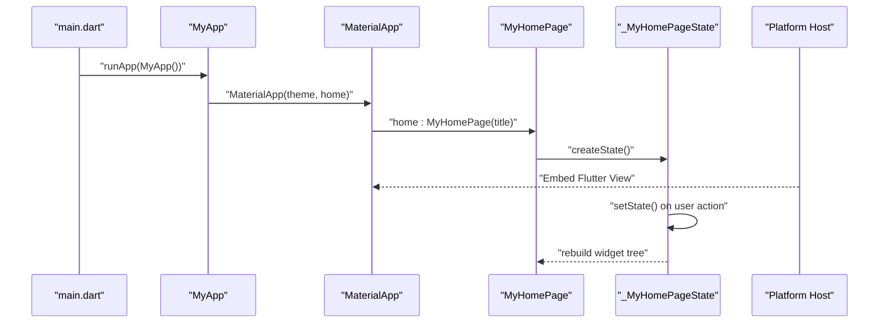
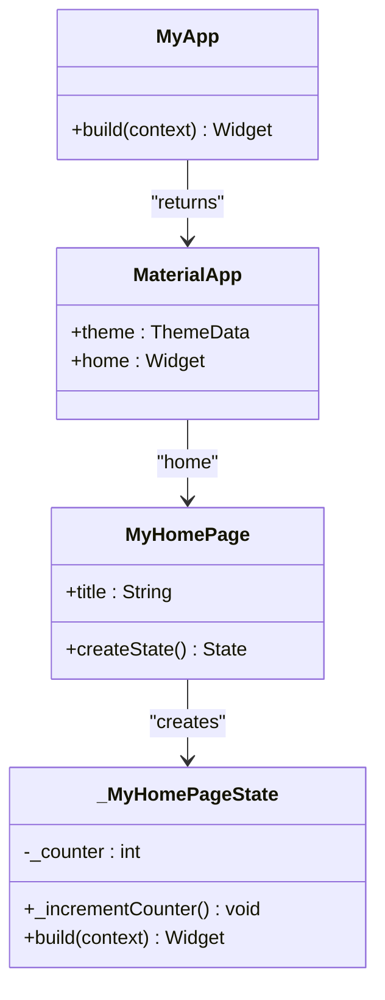
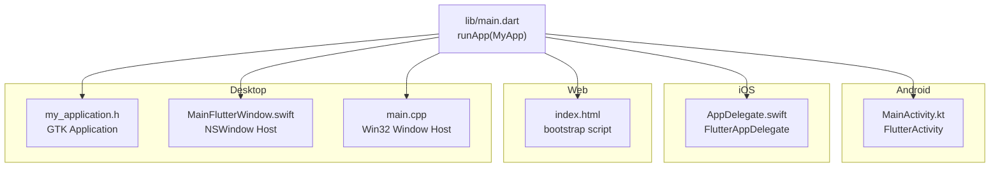
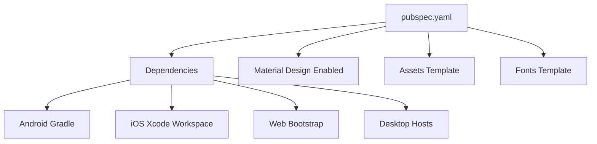
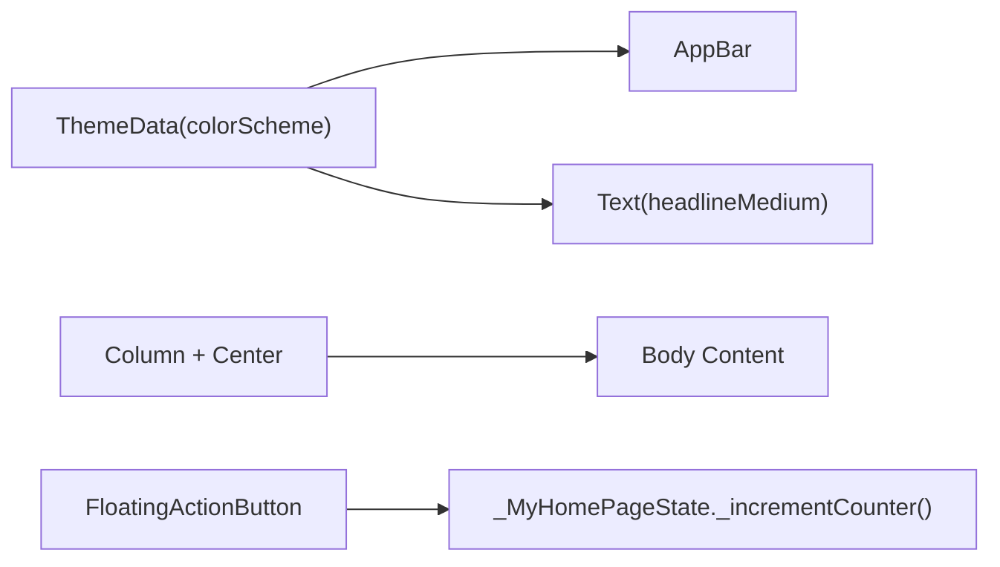
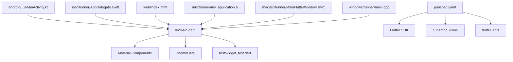

# Application Architecture

<cite>
**Referenced Files in This Document**
- [main.dart](file://lib/main.dart)
- [pubspec.yaml](file://pubspec.yaml)
- [MainActivity.kt](file://android/app/src/main/kotlin/com/example/asistensia_empleados/MainActivity.kt)
- [AppDelegate.swift](file://ios/Runner/AppDelegate.swift)
- [index.html](file://web/index.html)
- [my_application.h](file://linux/runner/my_application.h)
- [MainFlutterWindow.swift](file://macos/Runner/MainFlutterWindow.swift)
- [main.cpp](file://windows/runner/main.cpp)
- [analysis_options.yaml](file://analysis_options.yaml)
- [widget_test.dart](file://test/widget_test.dart)
</cite>

## Table of Contents
1. [Introduction](#introduction)
2. [Project Structure](#project-structure)
3. [Core Components](#core-components)
4. [Architecture Overview](#architecture-overview)
5. [Detailed Component Analysis](#detailed-component-analysis)
6. [Dependency Analysis](#dependency-analysis)
7. [Performance Considerations](#performance-considerations)
8. [Troubleshooting Guide](#troubleshooting-guide)
9. [Conclusion](#conclusion)

## Introduction
This document describes the architectural design of the Flutter employee attendance tracking application. The application follows Flutter’s widget-based architecture with a StatefulWidget pattern, centered around a root widget hierarchy that begins with MyApp, proceeds through MaterialApp, and culminates in MyHomePage. The document explains the reactive programming model driven by setState(), the multi-platform architecture supporting Android, iOS, Web, and Desktop platforms, and the build system configuration, asset management, and platform-specific integrations. Material Design and responsive layout are implemented using Flutter’s Material Components and layout widgets.

## Project Structure
The project is organized into platform-specific native entry points and shared Flutter code:
- lib/main.dart: Root widget and application entry point
- android/: Android native integration and Gradle build configuration
- ios/: iOS native integration and Xcode workspace
- web/: Web platform assets and HTML bootstrap
- linux/, macos/, windows/: Desktop platform native runners and Flutter integration
- pubspec.yaml: Package metadata, dependencies, and Flutter asset configuration
- analysis_options.yaml: Lint configuration for code quality
- test/widget_test.dart: Basic widget tests demonstrating reactive behavior

**Diagram sources**
- [main.dart](file://lib/main.dart)
- [pubspec.yaml](file://pubspec.yaml)
- [MainActivity.kt](file://android/app/src/main/kotlin/com/example/asistensia_empleados/MainActivity.kt)
- [AppDelegate.swift](file://ios/Runner/AppDelegate.swift)
- [index.html](file://web/index.html)
- [my_application.h](file://linux/runner/my_application.h)
- [MainFlutterWindow.swift](file://macos/Runner/MainFlutterWindow.swift)
- [main.cpp](file://windows/runner/main.cpp)

**Section sources**
- [main.dart](file://lib/main.dart)
- [pubspec.yaml](file://pubspec.yaml)

## Core Components
- MyApp (StatelessWidget): The root widget that configures the application theme and sets the home page.
- MyHomePage (StatefulWidget): A stateful screen containing a counter and a floating action button. Its state manages the counter value and triggers rebuilds via setState().
- MaterialApp: Provides the application shell with theme configuration and navigation context.
- Scaffold, AppBar, Column, Center, FloatingActionButton: Material Design widgets composing the UI.

Reactive programming model:
- setState() updates internal state and instructs the framework to rebuild the widget subtree, enabling immediate UI updates without manual DOM manipulation.

**Section sources**
- [main.dart:7-36](file://lib/main.dart#L7-L36)
- [main.dart:38-54](file://lib/main.dart#L38-L54)
- [main.dart:56-122](file://lib/main.dart#L56-L122)

## Architecture Overview
The application follows Flutter’s declarative paradigm:
- Entry point: main() invokes runApp(MyApp())
- MyApp builds MaterialApp with a theme and home page
- MyHomePage is the initial screen; its state manages UI state and reacts to user interactions
- Platform hosts initialize Flutter engines and embed the Flutter view

**Diagram sources**
- [main.dart:3-36](file://lib/main.dart#L3-L36)
- [main.dart:38-122](file://lib/main.dart#L38-L122)

## Detailed Component Analysis

### Root Widget Hierarchy and State Management
- MyApp (StatelessWidget): Defines the global theme and delegates to MaterialApp. It does not manage application state.
- MyHomePage (StatefulWidget): Holds a stateful configuration and creates a state instance. The state stores the counter and exposes an increment method that calls setState().
- Reactive rebuild: setState() triggers a rebuild of the widget tree, updating the UI immediately.

**Diagram sources**
- [main.dart:7-36](file://lib/main.dart#L7-L36)
- [main.dart:38-54](file://lib/main.dart#L38-L54)
- [main.dart:56-122](file://lib/main.dart#L56-L122)

**Section sources**
- [main.dart:7-36](file://lib/main.dart#L7-L36)
- [main.dart:38-54](file://lib/main.dart#L38-L54)
- [main.dart:56-122](file://lib/main.dart#L56-L122)

### Multi-Platform Architecture
- Android: MainActivity extends FlutterActivity and integrates with Gradle build configuration.
- iOS: AppDelegate registers plugins and initializes the Flutter engine.
- Web: index.html bootstraps the Flutter web runtime and loads assets.
- Desktop:
  - Linux: GTK-based application host declaration.
  - macOS: NSWindow-based host embedding FlutterViewController.
  - Windows: Win32 window host initializing the Flutter project and message loop.

**Diagram sources**
- [MainActivity.kt](file://android/app/src/main/kotlin/com/example/asistensia_empleados/MainActivity.kt)
- [AppDelegate.swift](file://ios/Runner/AppDelegate.swift)
- [index.html](file://web/index.html)
- [my_application.h](file://linux/runner/my_application.h)
- [MainFlutterWindow.swift](file://macos/Runner/MainFlutterWindow.swift)
- [main.cpp](file://windows/runner/main.cpp)
- [main.dart](file://lib/main.dart)

**Section sources**
- [MainActivity.kt](file://android/app/src/main/kotlin/com/example/asistensia_empleados/MainActivity.kt)
- [AppDelegate.swift](file://ios/Runner/AppDelegate.swift)
- [index.html](file://web/index.html)
- [my_application.h](file://linux/runner/my_application.h)
- [MainFlutterWindow.swift](file://macos/Runner/MainFlutterWindow.swift)
- [main.cpp](file://windows/runner/main.cpp)

### Build System and Asset Management
- pubspec.yaml:
  - Declares the package name, version, SDK constraint, and dependencies (flutter, cupertino_icons).
  - Enables Material Design and provides a template for assets and fonts.
- Android/iOS build:
  - Android uses Gradle Kotlin DSL (build.gradle.kts, settings.gradle.kts).
  - iOS uses Xcode workspace and Swift-based AppDelegate.
- Web:
  - index.html includes base href, manifest, and the Flutter bootstrap script.
- Desktop:
  - Linux/macOS/Windows integrate Flutter plugins and native window initialization.

**Diagram sources**
- [pubspec.yaml](file://pubspec.yaml)

**Section sources**
- [pubspec.yaml](file://pubspec.yaml)

### Material Design and Responsive Layout
- Material Components:
  - MyApp configures ThemeData with a color scheme derived from a seed color.
  - MyHomePage uses AppBar, Scaffold, Column, Center, and FloatingActionButton.
- Responsive behavior:
  - Column and Center arrange content and center children along the main axis.
  - Theme.of(context) applies typography and color schemes consistently across widgets.

**Diagram sources**
- [main.dart:15-34](file://lib/main.dart#L15-L34)
- [main.dart:78-121](file://lib/main.dart#L78-L121)

**Section sources**
- [main.dart:15-34](file://lib/main.dart#L15-L34)
- [main.dart:78-121](file://lib/main.dart#L78-L121)

## Dependency Analysis
- Internal dependencies:
  - main.dart depends on Flutter material components and defines the root widget hierarchy.
- External dependencies:
  - pubspec.yaml declares flutter SDK and cupertino_icons.
  - dev_dependencies include flutter_test and flutter_lints.
- Platform integration:
  - Android/iOS rely on FlutterActivity/FlutterAppDelegate registration.
  - Web relies on index.html bootstrap.
  - Desktop relies on native window hosts and plugin registrants.

**Diagram sources**
- [main.dart](file://lib/main.dart)
- [pubspec.yaml](file://pubspec.yaml)
- [MainActivity.kt](file://android/app/src/main/kotlin/com/example/asistensia_empleados/MainActivity.kt)
- [AppDelegate.swift](file://ios/Runner/AppDelegate.swift)
- [index.html](file://web/index.html)
- [my_application.h](file://linux/runner/my_application.h)
- [MainFlutterWindow.swift](file://macos/Runner/MainFlutterWindow.swift)
- [main.cpp](file://windows/runner/main.cpp)

**Section sources**
- [main.dart](file://lib/main.dart)
- [pubspec.yaml](file://pubspec.yaml)

## Performance Considerations
- Stateless vs Stateful widgets:
  - Use StatelessWidget for static UI to minimize rebuild overhead.
  - Use StatefulWidget only when UI state changes require rebuilds.
- setState() usage:
  - Batch state updates within a single setState() call to avoid unnecessary rebuilds.
- Material Design:
  - Leverage prebuilt Material components for optimized rendering and accessibility.
- Platform-specific optimizations:
  - Android/iOS: Ensure plugin registration is minimal and efficient.
  - Web: Load assets efficiently and defer heavy computations off the UI thread.
  - Desktop: Use native window sizing and event loops judiciously.

## Troubleshooting Guide
- Widget tests:
  - The test suite verifies initial state and the effect of tapping the floating action button, demonstrating the reactive behavior of setState().
- Common issues:
  - Incorrect theme usage: Ensure ThemeData is configured in MyApp and accessed via Theme.of(context) in descendant widgets.
  - Missing assets: Confirm asset entries in pubspec.yaml and verify paths.
  - Platform registration: Ensure GeneratedPluginRegistrant is registered on iOS and that MainActivity extends FlutterActivity on Android.
  - Web bootstrap: Verify index.html includes the Flutter bootstrap script and manifest.

**Section sources**
- [widget_test.dart:13-30](file://test/widget_test.dart#L13-L30)

## Conclusion
The application demonstrates a clean Flutter architecture with a root widget hierarchy, reactive state management using setState(), and robust multi-platform support. The Material Design system and responsive layout widgets provide a consistent user experience across Android, iOS, Web, and Desktop. The build configuration and asset management are structured to support scalable development and deployment across platforms.