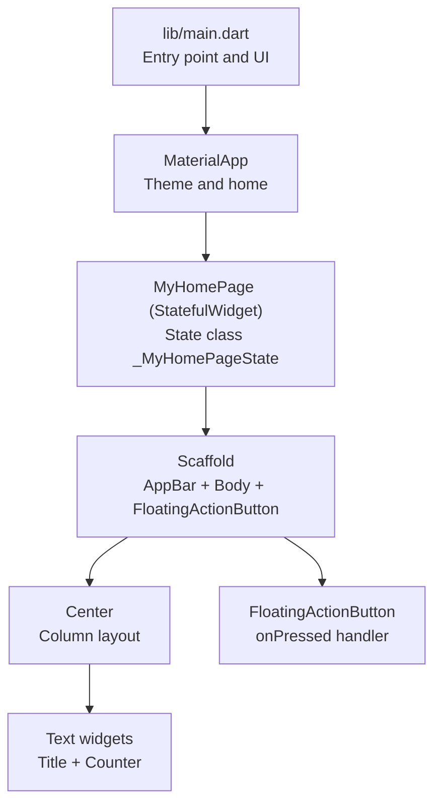
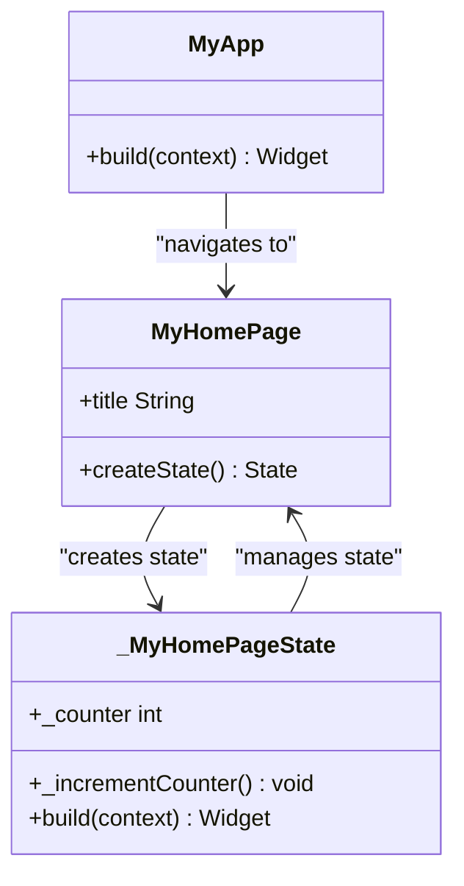
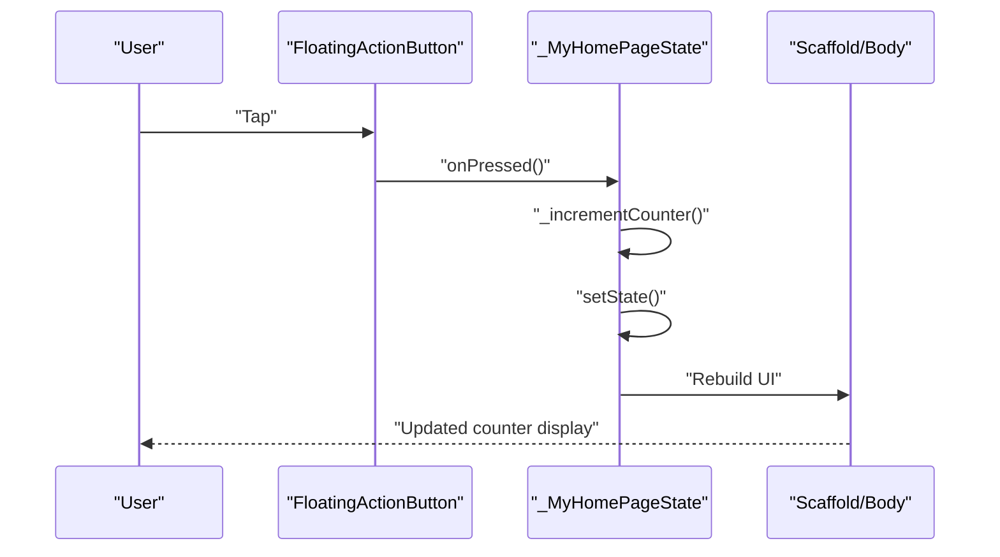
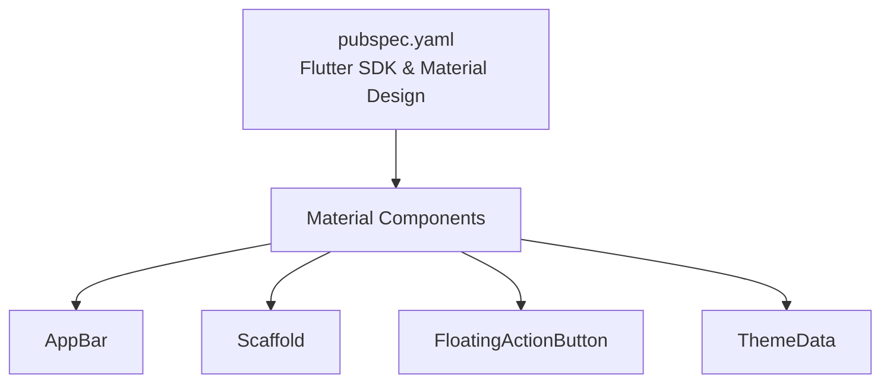

# Core Features

<cite>
**Referenced Files in This Document**
- [main.dart](file://lib/main.dart)
- [pubspec.yaml](file://pubspec.yaml)
- [widget_test.dart](file://test/widget_test.dart)
- [README.md](file://README.md)
</cite>

## Table of Contents
1. [Introduction](#introduction)
2. [Project Structure](#project-structure)
3. [Core Components](#core-components)
4. [Architecture Overview](#architecture-overview)
5. [Detailed Component Analysis](#detailed-component-analysis)
6. [Dependency Analysis](#dependency-analysis)
7. [Performance Considerations](#performance-considerations)
8. [Troubleshooting Guide](#troubleshooting-guide)
9. [Conclusion](#conclusion)

## Introduction
This document explains the core features of the employee attendance tracking application, focusing on the counter-based UI implementation, state management with setState(), and the floating action button functionality. It also documents the Material Design implementation including AppBar, Scaffold, and responsive layout patterns. Concrete examples from the main.dart file illustrate widget composition, stateful components, and user interaction handling. The relationship between the StatefulWidget MyHomePage and its state class _MyHomePageState is clarified, along with common UI patterns that serve as foundations for building more complex attendance tracking features.

## Project Structure
The application follows a minimal Flutter project structure with a single entry point in lib/main.dart. The pubspec.yaml configures the Flutter SDK, Material Design usage, and development dependencies. Tests reside under test/widget_test.dart and demonstrate a smoke test for the counter behavior.

**Diagram sources**
- [main.dart:3-36](file://lib/main.dart#L3-L36)
- [main.dart:38-54](file://lib/main.dart#L38-L54)
- [main.dart:56-122](file://lib/main.dart#L56-L122)

**Section sources**
- [main.dart:1-123](file://lib/main.dart#L1-L123)
- [pubspec.yaml:1-90](file://pubspec.yaml#L1-L90)
- [README.md:1-17](file://README.md#L1-L17)

## Core Components
This section highlights the primary building blocks used in the application’s UI and state management.

- Stateless application shell: MyApp sets up the MaterialApp with a theme and routes to the home page.
- Stateful home page: MyHomePage is a StatefulWidget that encapsulates interactive state and builds the UI.
- State class: _MyHomePageState manages the counter state and updates the UI via setState().
- Material scaffold: Scaffold organizes the AppBar, body content, and floating action button.
- Responsive layout: Center and Column arrange content vertically and center it within the screen.
- Floating action button: A primary affordance to increment the counter with a tooltip and icon.

These components collectively demonstrate a minimal yet complete Flutter application that can be extended to support attendance tracking features such as employee records, check-in/out actions, and data persistence.

**Section sources**
- [main.dart:7-36](file://lib/main.dart#L7-L36)
- [main.dart:38-54](file://lib/main.dart#L38-L54)
- [main.dart:56-122](file://lib/main.dart#L56-L122)

## Architecture Overview
The application uses a classic Flutter architecture:
- MyApp is the root StatelessWidget that configures the app theme and navigation target.
- MyHomePage is the root StatefulWidget that holds mutable state and renders the UI.
- _MyHomePageState implements the build method and handles user interactions through setState().

**Diagram sources**
- [main.dart:7-36](file://lib/main.dart#L7-L36)
- [main.dart:38-54](file://lib/main.dart#L38-L54)
- [main.dart:56-122](file://lib/main.dart#L56-L122)

## Detailed Component Analysis

### MyApp: Application Shell and Theme
- Purpose: Wraps the entire app with MaterialApp, sets the application title, and applies a theme derived from a color seed.
- Behavior: Provides a consistent theme across the app and sets the home route to MyHomePage with a title.
- Material Design: Uses ThemeData with a color scheme derived from a seed color, enabling dynamic theming.

Key implementation references:
- [MaterialApp configuration:13-35](file://lib/main.dart#L13-L35)

**Section sources**
- [main.dart:7-36](file://lib/main.dart#L7-L36)

### MyHomePage: Stateful Home Page
- Purpose: Serves as the main screen of the application and is responsible for managing stateful UI.
- Characteristics:
  - Extends StatefulWidget.
  - Holds a final title field passed from the parent.
  - Creates an instance of _MyHomePageState via createState().

Key implementation references:
- [StatefulWidget definition and constructor:38-54](file://lib/main.dart#L38-L54)

**Section sources**
- [main.dart:38-54](file://lib/main.dart#L38-L54)

### _MyHomePageState: State Management and UI Rendering
- State: Maintains an integer counter initialized to zero.
- Methods:
  - _incrementCounter(): Increments the counter and triggers a UI rebuild via setState().
  - build(): Constructs the UI using Scaffold, AppBar, body content, and a FloatingActionButton.

UI Composition Highlights:
- Scaffold provides the overall app structure with top app bar, body, and floating action button.
- AppBar displays the page title and uses the theme’s inverse primary color for contrast.
- Body centers content using Center and arranges two Text widgets in a Column: a label and the counter value.
- FloatingActionButton triggers the increment action and shows a tooltip.

Key implementation references:
- [State class and counter initialization:56-68](file://lib/main.dart#L56-L68)
- [Scaffold, AppBar, and body layout:78-114](file://lib/main.dart#L78-L114)
- [FloatingActionButton and onPressed handler:115-119](file://lib/main.dart#L115-L119)

**Diagram sources**
- [main.dart:59-68](file://lib/main.dart#L59-L68)
- [main.dart:115-119](file://lib/main.dart#L115-L119)
- [main.dart:78-114](file://lib/main.dart#L78-L114)

**Section sources**
- [main.dart:56-122](file://lib/main.dart#L56-L122)

### Counter-Based UI Implementation
- Pattern: A simple counter demonstrates reactive UI updates driven by state changes.
- Layout: Center aligns the column, and Column stacks a descriptive label and the counter value.
- Theming: The counter text adopts the headlineMedium style from the current theme.

Key implementation references:
- [Counter label and value rendering:107-111](file://lib/main.dart#L107-L111)
- [Center and Column arrangement:88-114](file://lib/main.dart#L88-L114)

**Section sources**
- [main.dart:88-114](file://lib/main.dart#L88-L114)

### State Management with setState()
- Mechanism: setState() marks the state as changed and triggers a rebuild of the UI subtree.
- Example: _incrementCounter() updates the internal counter and calls setState() to refresh the display.
- Benefits: Ensures UI consistency and minimizes manual DOM manipulation.

Key implementation references:
- [_incrementCounter() and setState() usage:59-68](file://lib/main.dart#L59-L68)

**Section sources**
- [main.dart:59-68](file://lib/main.dart#L59-L68)

### Floating Action Button Functionality
- Role: Provides a primary action to increment the counter.
- Interaction: onPressed delegates to _incrementCounter(), which updates state and rebuilds the UI.
- Accessibility: Tooltip improves discoverability.

Key implementation references:
- [FloatingActionButton configuration:115-119](file://lib/main.dart#L115-L119)

**Section sources**
- [main.dart:115-119](file://lib/main.dart#L115-L119)

### Material Design: AppBar, Scaffold, and Responsive Layout
- AppBar: Displays the page title and uses the theme’s inverse primary color for contrast.
- Scaffold: Centralizes the app’s layout with top app bar, body, and floating action button.
- Responsive layout: Center and Column create a vertically centered, adaptive arrangement suitable for different screen sizes.

Key implementation references:
- [AppBar configuration:79-87](file://lib/main.dart#L79-L87)
- [Scaffold and body composition:78-114](file://lib/main.dart#L78-L114)

**Section sources**
- [main.dart:78-114](file://lib/main.dart#L78-L114)

### Relationship Between MyHomePage and _MyHomePageState
- MyHomePage is the widget configuration and lifecycle host.
- _MyHomePageState is the mutable state holder that rebuilds the UI in response to user interactions.
- The state class accesses the widget’s properties via the widget reference and manages internal state changes.

Key implementation references:
- [StatefulWidget creation](file://lib/main.dart#L53)
- [State class access to widget.title](file://lib/main.dart#L86)

**Section sources**
- [main.dart:53](file://lib/main.dart#L53)
- [main.dart:86](file://lib/main.dart#L86)

### Common UI Patterns Demonstrated
- Stateless wrapper (MyApp): Encapsulates global configuration and navigation.
- Stateful container (MyHomePage): Manages local state and coordinates user interactions.
- Reactive updates (setState): Drives UI rebuilds upon state changes.
- Material layout primitives (Scaffold, AppBar, FloatingActionButton): Provide consistent, accessible UI structure.
- Responsive composition (Center, Column): Offer flexible, device-friendly layouts.

These patterns form the foundation for extending the application to support attendance tracking features such as employee lists, check-in/out buttons, and data persistence.

**Section sources**
- [main.dart:7-36](file://lib/main.dart#L7-L36)
- [main.dart:38-54](file://lib/main.dart#L38-L54)
- [main.dart:56-122](file://lib/main.dart#L56-L122)

## Dependency Analysis
The application relies on Flutter’s Material components and the built-in Material Icons font. The pubspec.yaml declares Flutter SDK constraints and enables Material Design usage.

**Diagram sources**
- [pubspec.yaml:21-58](file://pubspec.yaml#L21-L58)
- [main.dart:13-35](file://lib/main.dart#L13-L35)

**Section sources**
- [pubspec.yaml:21-58](file://pubspec.yaml#L21-L58)
- [main.dart:13-35](file://lib/main.dart#L13-L35)

## Performance Considerations
- Rebuild scope: setState() triggers a rebuild of the widget subtree; keep state scoped to minimize unnecessary rebuilds.
- Layout efficiency: Using Center and Column avoids complex calculations and adapts well to varying screen sizes.
- Theming: Leveraging Theme.of(context) ensures consistent styling and reduces duplication.

[No sources needed since this section provides general guidance]

## Troubleshooting Guide
- Counter does not update after tapping the floating action button:
  - Ensure onPressed calls a method that invokes setState().
  - Confirm the method updates the internal state before calling setState().
- Theme changes not reflected:
  - Verify ThemeData is configured in MyApp and that widgets consume Theme.of(context).
- Test failures:
  - The smoke test validates initial counter text and post-tap state. Review test expectations and ensure the app is pumped with MyApp before interactions.

Key implementation references:
- [Test expectations and tap gesture:14-29](file://test/widget_test.dart#L14-L29)

**Section sources**
- [widget_test.dart:14-29](file://test/widget_test.dart#L14-L29)

## Conclusion
The application demonstrates essential Flutter patterns for building interactive, state-driven UIs. The counter-based UI, state management with setState(), and Material Design components provide a solid foundation for developing more advanced attendance tracking features. The documented relationships and patterns enable scalable enhancements such as employee records, check-in/out workflows, and persistent storage.