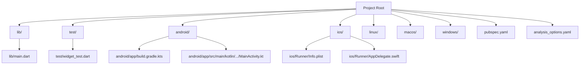
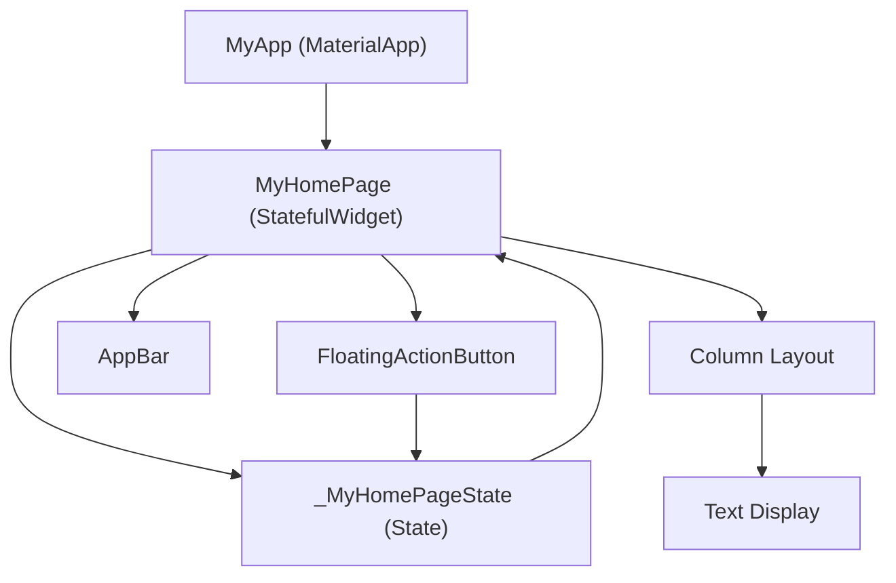
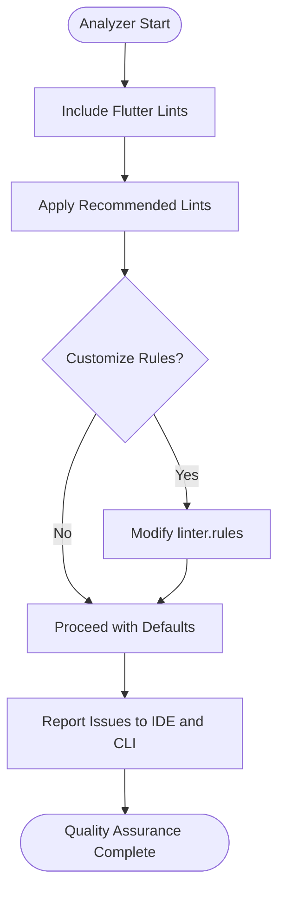
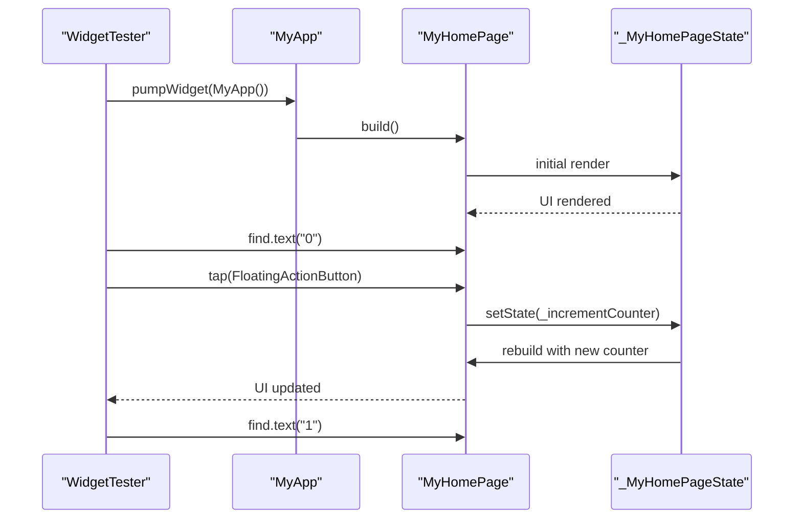
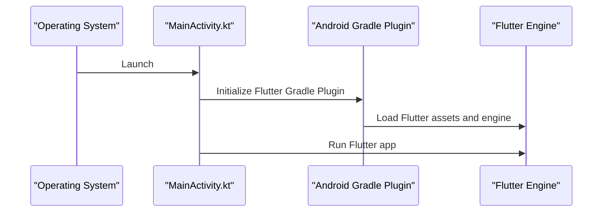
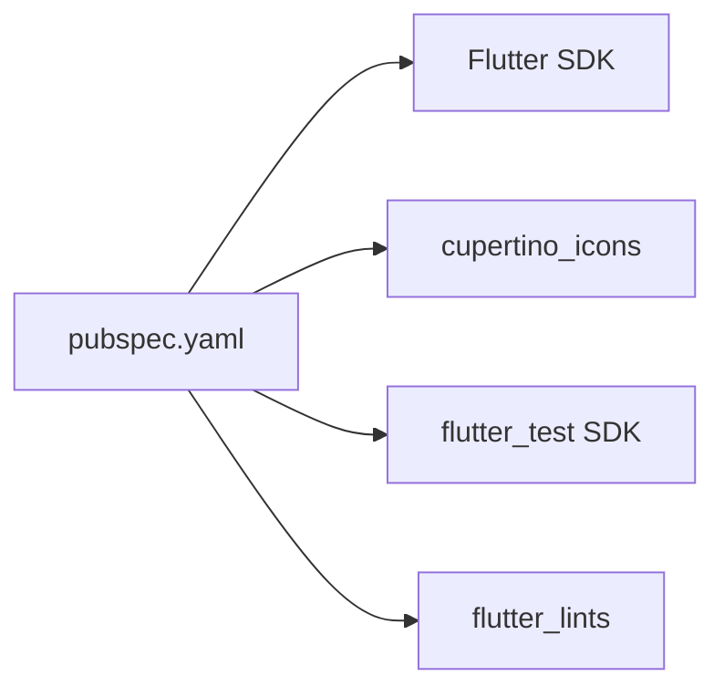

# Development Guidelines

<cite>
**Referenced Files in This Document**
- [analysis_options.yaml](file://analysis_options.yaml)
- [pubspec.yaml](file://pubspec.yaml)
- [lib/main.dart](file://lib/main.dart)
- [test/widget_test.dart](file://test/widget_test.dart)
- [android/app/src/main/kotlin/com/example/asistensia_empleados/MainActivity.kt](file://android/app/src/main/kotlin/com/example/asistensia_empleados/MainActivity.kt)
- [android/app/build.gradle.kts](file://android/app/build.gradle.kts)
- [ios/Runner/AppDelegate.swift](file://ios/Runner/AppDelegate.swift)
- [ios/Runner/Info.plist](file://ios/Runner/Info.plist)
- [README.md](file://README.md)
</cite>

## Table of Contents
1. [Introduction](#introduction)
2. [Project Structure](#project-structure)
3. [Core Components](#core-components)
4. [Architecture Overview](#architecture-overview)
5. [Detailed Component Analysis](#detailed-component-analysis)
6. [Dependency Analysis](#dependency-analysis)
7. [Performance Considerations](#performance-considerations)
8. [Troubleshooting Guide](#troubleshooting-guide)
9. [Conclusion](#conclusion)
10. [Appendices](#appendices)

## Introduction
This document provides comprehensive development guidelines for the Flutter employee attendance tracking project. It consolidates code organization principles, naming conventions, and best practices tailored for Flutter development. It explains the linting rules defined in analysis_options.yaml and their role in maintaining code quality, details the testing strategy using Flutter’s widget testing framework as demonstrated in test/widget_test.dart, and outlines guidelines for consistent code style, import organization, and project file structure. Finally, it addresses performance considerations, debugging techniques, and development workflow optimization for building the attendance tracking system.

## Project Structure
The project follows Flutter’s standard structure with platform-specific configurations under android/, ios/, linux/, macos/, and windows/. The application entry point resides in lib/main.dart, while automated tests live under test/. The analysis_options.yaml file centralizes linting rules, and pubspec.yaml manages dependencies and metadata.

**Diagram sources**
- [lib/main.dart](file://lib/main.dart)
- [test/widget_test.dart](file://test/widget_test.dart)
- [android/app/build.gradle.kts](file://android/app/build.gradle.kts)
- [android/app/src/main/kotlin/com/example/asistensia_empleados/MainActivity.kt](file://android/app/src/main/kotlin/com/example/asistensia_empleados/MainActivity.kt)
- [ios/Runner/Info.plist](file://ios/Runner/Info.plist)
- [ios/Runner/AppDelegate.swift](file://ios/Runner/AppDelegate.swift)
- [pubspec.yaml](file://pubspec.yaml)
- [analysis_options.yaml](file://analysis_options.yaml)

**Section sources**
- [lib/main.dart](file://lib/main.dart)
- [test/widget_test.dart](file://test/widget_test.dart)
- [android/app/build.gradle.kts](file://android/app/build.gradle.kts)
- [android/app/src/main/kotlin/com/example/asistensia_empleados/MainActivity.kt](file://android/app/src/main/kotlin/com/example/asistensia_empleados/MainActivity.kt)
- [ios/Runner/Info.plist](file://ios/Runner/Info.plist)
- [ios/Runner/AppDelegate.swift](file://ios/Runner/AppDelegate.swift)
- [pubspec.yaml](file://pubspec.yaml)
- [analysis_options.yaml](file://analysis_options.yaml)

## Core Components
- Application entry point: The app initializes in lib/main.dart with a root StatelessWidget MyApp and a stateful home page MyHomePage containing a counter example. This demonstrates Flutter’s widget composition and state management patterns.
- Platform integration:
  - Android: MainActivity.kt extends FlutterActivity and is configured in android/app/build.gradle.kts with the Flutter Gradle plugin and Java 17 compatibility.
  - iOS: AppDelegate.swift registers plugins and sets up the Flutter lifecycle.
- Testing foundation: test/widget_test.dart showcases a smoke test using WidgetTester to pump the app, assert initial state, and simulate user interactions.

**Section sources**
- [lib/main.dart](file://lib/main.dart)
- [android/app/src/main/kotlin/com/example/asistensia_empleados/MainActivity.kt](file://android/app/src/main/kotlin/com/example/asistensia_empleados/MainActivity.kt)
- [android/app/build.gradle.kts](file://android/app/build.gradle.kts)
- [ios/Runner/AppDelegate.swift](file://ios/Runner/AppDelegate.swift)
- [test/widget_test.dart](file://test/widget_test.dart)

## Architecture Overview
The application architecture is a typical Flutter app with a Material Design theme and a single-page home screen. The stateful home page manages a counter and updates the UI via setState. Platform-specific bootstrapping is handled by platform entry points.

**Diagram sources**
- [lib/main.dart](file://lib/main.dart)

**Section sources**
- [lib/main.dart](file://lib/main.dart)

## Detailed Component Analysis

### Linting and Code Quality (analysis_options.yaml)
- Purpose: analysis_options.yaml configures the analyzer to enforce Flutter-recommended lints and surface static analysis issues in IDEs and via flutter analyze.
- Inclusion: The file includes flutter_lints/flutter.yaml to activate recommended rules for Flutter apps, packages, and plugins.
- Customization: Rules can be enabled or disabled in the linter.rules section. Individual suppressions can be applied per-line or per-file using ignore comments.
- Importance: Consistent lint enforcement improves readability, reduces bugs, and enforces team-wide style standards.

**Diagram sources**
- [analysis_options.yaml](file://analysis_options.yaml)

**Section sources**
- [analysis_options.yaml](file://analysis_options.yaml)

### Testing Strategy (test/widget_test.dart)
- Objective: Demonstrates a smoke test using WidgetTester to validate UI behavior.
- Steps:
  - Import required packages and the app entry point.
  - Use testWidgets to define a test case.
  - Pump the app with MyApp().
  - Assert initial state (e.g., presence of a specific text).
  - Simulate user interaction (tap a FloatingActionButton).
  - Re-pump and assert updated state.
- Best practices:
  - Keep tests focused and deterministic.
  - Use find helpers to locate widgets by semantics, icons, or text.
  - Prefer async operations with pump() to ensure UI updates.
  - Group related tests and use descriptive names.

**Diagram sources**
- [test/widget_test.dart](file://test/widget_test.dart)
- [lib/main.dart](file://lib/main.dart)

**Section sources**
- [test/widget_test.dart](file://test/widget_test.dart)
- [lib/main.dart](file://lib/main.dart)

### Platform Bootstrapping
- Android:
  - MainActivity.kt extends FlutterActivity, enabling Flutter embedding.
  - build.gradle.kts applies the Flutter Gradle plugin, sets Java 17 compatibility, and aligns SDK versions with Flutter’s computed values.
- iOS:
  - AppDelegate.swift registers plugins and handles application lifecycle events.
  - Info.plist defines bundle identifiers, display names, supported orientations, and other metadata.

**Diagram sources**
- [android/app/src/main/kotlin/com/example/asistensia_empleados/MainActivity.kt](file://android/app/src/main/kotlin/com/example/asistensia_empleados/MainActivity.kt)
- [android/app/build.gradle.kts](file://android/app/build.gradle.kts)

**Section sources**
- [android/app/src/main/kotlin/com/example/asistensia_empleados/MainActivity.kt](file://android/app/src/main/kotlin/com/example/asistensia_empleados/MainActivity.kt)
- [android/app/build.gradle.kts](file://android/app/build.gradle.kts)
- [ios/Runner/AppDelegate.swift](file://ios/Runner/AppDelegate.swift)
- [ios/Runner/Info.plist](file://ios/Runner/Info.plist)

## Dependency Analysis
- pubspec.yaml defines:
  - Environment: Dart SDK constraint aligned with Flutter’s SDK.
  - Dependencies: flutter SDK and cupertino_icons.
  - Dev dependencies: flutter_test SDK and flutter_lints for linting.
  - Flutter section: enables Material Design icons and provides hooks for assets and fonts.
- analysis_options.yaml references flutter_lints to enforce recommended rules.

**Diagram sources**
- [pubspec.yaml](file://pubspec.yaml)
- [analysis_options.yaml](file://analysis_options.yaml)

**Section sources**
- [pubspec.yaml](file://pubspec.yaml)
- [analysis_options.yaml](file://analysis_options.yaml)

## Performance Considerations
- Hot reload vs. hot restart:
  - Hot reload preserves application state and is ideal for iterative UI changes.
  - Hot restart resets state and is necessary when changing code that affects initialization.
- UI rebuild optimization:
  - Flutter optimizes rebuilds; prefer setState only when necessary and keep rebuild scopes minimal.
- Debugging:
  - Use “Toggle Debug Paint” to visualize widget boundaries and layout performance.
  - Inspect widget trees and performance metrics in the Flutter DevTools.
- Linting benefits:
  - Enforcing style and performance-related lints helps catch potential issues early.

[No sources needed since this section provides general guidance]

## Troubleshooting Guide
- Running and verifying:
  - Use flutter run to launch the app and observe hot reload behavior.
  - Use flutter analyze to check for lint violations and static analysis issues.
  - Use flutter test to execute widget tests and verify UI behavior.
- Common issues:
  - Lint failures: Review analysis_options.yaml and adjust rules as needed; apply per-line or per-file ignores when justified.
  - Platform-specific errors: Verify Android Gradle plugin configuration and iOS Info.plist settings.
  - Test flakiness: Ensure async operations are awaited and UI is pumped between interactions.

**Section sources**
- [analysis_options.yaml](file://analysis_options.yaml)
- [test/widget_test.dart](file://test/widget_test.dart)
- [README.md](file://README.md)

## Conclusion
These guidelines establish a consistent foundation for developing the Flutter employee attendance tracking application. They emphasize linting-driven quality, robust testing with WidgetTester, disciplined code organization, and platform-specific bootstrapping. By adhering to these practices, teams can maintain clean, reliable, and scalable code while optimizing the development workflow.

[No sources needed since this section summarizes without analyzing specific files]

## Appendices

### Naming Conventions and Code Organization Principles
- File naming:
  - Use snake_case for filenames (e.g., main.dart).
  - Place feature-related files under feature-specific directories (e.g., lib/features/attendance/) as the project evolves.
- Class and widget naming:
  - Use PascalCase for classes and widgets (e.g., MyApp, MyHomePage).
  - Prefix internal state classes with underscores (e.g., _MyHomePageState).
- Function and variable naming:
  - Use camelCase for functions and variables (e.g., _incrementCounter, _counter).
- Imports:
  - Group imports by category: Dart SDK, external packages, and internal libraries.
  - Keep imports sorted alphabetically within each group.
- Comments:
  - Add explanatory comments for complex logic and public APIs.
  - Reference relevant issues or design documents when applicable.

[No sources needed since this section provides general guidance]

### Testing Strategy Recommendations
- Unit tests:
  - Test pure functions and business logic in isolation using Dart’s test framework.
- Widget tests:
  - Use flutter_test and WidgetTester to validate UI behavior and user interactions.
  - Keep tests small, focused, and deterministic.
- Integration tests:
  - Validate end-to-end flows using integration_test for deeper system verification.

[No sources needed since this section provides general guidance]

### Development Workflow Optimization
- IDE setup:
  - Enable Dart and Flutter plugins; configure analysis options and code formatting.
- Pre-commit checks:
  - Run flutter analyze and flutter test locally before committing.
- CI/CD:
  - Integrate flutter analyze and flutter test in CI pipelines to enforce quality gates.

[No sources needed since this section provides general guidance]