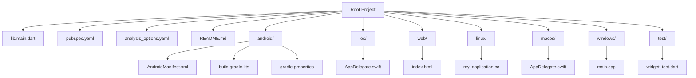

# Getting Started

<cite>
**Referenced Files in This Document**
- [README.md](file://README.md)
- [pubspec.yaml](file://pubspec.yaml)
- [analysis_options.yaml](file://analysis_options.yaml)
- [lib/main.dart](file://lib/main.dart)
- [android/app/src/main/AndroidManifest.xml](file://android/app/src/main/AndroidManifest.xml)
- [android/build.gradle.kts](file://android/build.gradle.kts)
- [android/gradle.properties](file://android/gradle.properties)
- [ios/Runner/AppDelegate.swift](file://ios/Runner/AppDelegate.swift)
- [macos/Runner/AppDelegate.swift](file://macos/Runner/AppDelegate.swift)
- [linux/runner/my_application.cc](file://linux/runner/my_application.cc)
- [windows/runner/main.cpp](file://windows/runner/main.cpp)
- [web/index.html](file://web/index.html)
- [test/widget_test.dart](file://test/widget_test.dart)
</cite>

## Table of Contents
1. [Introduction](#introduction)
2. [Prerequisites](#prerequisites)
3. [Installation](#installation)
4. [Project Structure](#project-structure)
5. [Running the Application](#running-the-application)
6. [Platform-Specific Setup](#platform-specific-setup)
7. [Verification Steps](#verification-steps)
8. [Troubleshooting Guide](#troubleshooting-guide)
9. [Conclusion](#conclusion)

## Introduction
This guide helps you set up and run the employee attendance tracking application built with Flutter. The project is a standard Flutter application scaffold with support for Android, iOS, Web, Linux, macOS, and Windows platforms. It includes a basic counter demo UI and foundational configurations for cross-platform deployment.

## Prerequisites
Before installing and running the application, ensure you have the following installed on your development machine:

- Flutter SDK: The project specifies a Dart SDK constraint that requires a compatible Flutter version. See [pubspec.yaml:21-23](file://pubspec.yaml#L21-L23) for the exact requirement.
- Platform-specific toolchains:
  - Android: Android Studio or Android SDK with Gradle configured
  - iOS: Xcode (Apple macOS recommended)
  - Web: No additional tools required beyond Flutter SDK
  - Desktop: Linux, macOS, or Windows with respective system libraries
- Development Environment:
  - Android Studio or VS Code with Flutter/Dart extensions
  - Android emulator or iOS simulator, or a physical device connected via USB

These requirements align with the Flutter SDK constraint and platform targets indicated by the repository structure.

**Section sources**
- [pubspec.yaml:21-23](file://pubspec.yaml#L21-L23)

## Installation
Follow these steps to clone the repository, install dependencies, and run the first build:

1. Clone the repository to your local machine using Git.
2. Open a terminal/command prompt in the project root directory.
3. Install dependencies:
   - Run `flutter pub get` to fetch Dart dependencies defined in [pubspec.yaml:30-47](file://pubspec.yaml#L30-L47).
4. Generate plugin registrants and build artifacts:
   - Run `flutter pub run build_runner build --delete-conflicting-outputs` if code generation is required (not applicable for this project).
5. Verify the project structure:
   - Confirm the presence of platform folders: android/, ios/, linux/, macos/, windows/, web/.
   - Confirm the main entry point exists at lib/main.dart.

At this point, you can run the application on your chosen platform using `flutter run`.

**Section sources**
- [pubspec.yaml:30-47](file://pubspec.yaml#L30-L47)
- [lib/main.dart:1-123](file://lib/main.dart#L1-L123)

## Project Structure
The repository follows a standard Flutter project layout with platform-specific native integrations:

- Root-level configuration:
  - [pubspec.yaml:1-90](file://pubspec.yaml#L1-L90): Defines package metadata, dependencies, dev dependencies, and Flutter-specific assets/fonts configuration.
  - [analysis_options.yaml:1-29](file://analysis_options.yaml#L1-L29): Configures lint rules and analysis options for the project.
  - [README.md:1-17](file://README.md#L1-L17): Provides project overview and links to Flutter resources.
- Application entry point:
  - [lib/main.dart:1-123](file://lib/main.dart#L1-L123): Contains the main application entry point and a basic counter UI scaffold.
- Platform integrations:
  - Android: [AndroidManifest.xml:1-46](file://android/app/src/main/AndroidManifest.xml#L1-L46), [build.gradle.kts:1-25](file://android/build.gradle.kts#L1-L25), [gradle.properties:1-3](file://android/gradle.properties#L1-L3)
  - iOS: [AppDelegate.swift:1-14](file://ios/Runner/AppDelegate.swift#L1-L14)
  - Web: [index.html:1-39](file://web/index.html#L1-L39)
  - Linux: [my_application.cc:1-149](file://linux/runner/my_application.cc#L1-L149)
  - macOS: [AppDelegate.swift:1-14](file://macos/Runner/AppDelegate.swift#L1-L14)
  - Windows: [main.cpp:1-44](file://windows/runner/main.cpp#L1-L44)
- Tests:
  - [test/widget_test.dart:1-31](file://test/widget_test.dart#L1-L31): Basic widget test verifying the counter UI.

**Diagram sources**
- [lib/main.dart:1-123](file://lib/main.dart#L1-L123)
- [pubspec.yaml:1-90](file://pubspec.yaml#L1-L90)
- [analysis_options.yaml:1-29](file://analysis_options.yaml#L1-L29)
- [README.md:1-17](file://README.md#L1-L17)
- [android/app/src/main/AndroidManifest.xml:1-46](file://android/app/src/main/AndroidManifest.xml#L1-L46)
- [android/build.gradle.kts:1-25](file://android/build.gradle.kts#L1-L25)
- [android/gradle.properties:1-3](file://android/gradle.properties#L1-L3)
- [ios/Runner/AppDelegate.swift:1-14](file://ios/Runner/AppDelegate.swift#L1-L14)
- [web/index.html:1-39](file://web/index.html#L1-L39)
- [linux/runner/my_application.cc:1-149](file://linux/runner/my_application.cc#L1-L149)
- [macos/Runner/AppDelegate.swift:1-14](file://macos/Runner/AppDelegate.swift#L1-L14)
- [windows/runner/main.cpp:1-44](file://windows/runner/main.cpp#L1-L44)
- [test/widget_test.dart:1-31](file://test/widget_test.dart#L1-L31)

**Section sources**
- [pubspec.yaml:1-90](file://pubspec.yaml#L1-L90)
- [lib/main.dart:1-123](file://lib/main.dart#L1-L123)
- [android/app/src/main/AndroidManifest.xml:1-46](file://android/app/src/main/AndroidManifest.xml#L1-L46)
- [ios/Runner/AppDelegate.swift:1-14](file://ios/Runner/AppDelegate.swift#L1-L14)
- [web/index.html:1-39](file://web/index.html#L1-L39)
- [linux/runner/my_application.cc:1-149](file://linux/runner/my_application.cc#L1-L149)
- [macos/Runner/AppDelegate.swift:1-14](file://macos/Runner/AppDelegate.swift#L1-L14)
- [windows/runner/main.cpp:1-44](file://windows/runner/main.cpp#L1-L44)
- [test/widget_test.dart:1-31](file://test/widget_test.dart#L1-L31)

## Running the Application
To run the application on different platforms, use the Flutter CLI with the appropriate target device or platform:

- Android:
  - Connect an Android device via USB or start an Android emulator.
  - Run `flutter run` in the project root.
  - The Android manifest configuration is defined in [AndroidManifest.xml:1-46](file://android/app/src/main/AndroidManifest.xml#L1-L46).

- iOS:
  - On macOS with Xcode installed, connect an iOS device or start an iOS simulator.
  - Run `flutter run` in the project root.
  - The iOS entry point is handled by [AppDelegate.swift:1-14](file://ios/Runner/AppDelegate.swift#L1-L14).

- Web:
  - Run `flutter run -d chrome` or `flutter run -d web-server` to launch in a browser.
  - The web entry point is defined in [index.html:1-39](file://web/index.html#L1-L39).

- Linux:
  - Ensure Linux desktop dependencies are installed.
  - Run `flutter run -d linux` in the project root.
  - The Linux application lifecycle is implemented in [my_application.cc:1-149](file://linux/runner/my_application.cc#L1-L149).

- macOS:
  - Ensure macOS desktop dependencies are installed.
  - Run `flutter run -d macos` in the project root.
  - The macOS entry point is handled by [AppDelegate.swift:1-14](file://macos/Runner/AppDelegate.swift#L1-L14).

- Windows:
  - Ensure Windows desktop dependencies are installed.
  - Run `flutter run -d windows` in the project root.
  - The Windows application lifecycle is implemented in [main.cpp:1-44](file://windows/runner/main.cpp#L1-L44).

For quick verification, you can also run `flutter doctor` to check your environment setup and resolve any missing prerequisites.

**Section sources**
- [android/app/src/main/AndroidManifest.xml:1-46](file://android/app/src/main/AndroidManifest.xml#L1-L46)
- [ios/Runner/AppDelegate.swift:1-14](file://ios/Runner/AppDelegate.swift#L1-L14)
- [web/index.html:1-39](file://web/index.html#L1-L39)
- [linux/runner/my_application.cc:1-149](file://linux/runner/my_application.cc#L1-L149)
- [macos/Runner/AppDelegate.swift:1-14](file://macos/Runner/AppDelegate.swift#L1-L14)
- [windows/runner/main.cpp:1-44](file://windows/runner/main.cpp#L1-L44)

## Platform-Specific Setup
This section outlines platform-specific considerations and configurations:

- Android:
  - Ensure Android Studio or Android SDK is installed and configured.
  - The Gradle build configuration is defined in [build.gradle.kts:1-25](file://android/build.gradle.kts#L1-L25) and JVM memory settings in [gradle.properties:1-3](file://android/gradle.properties#L1-L3).
  - The application manifest is configured in [AndroidManifest.xml:1-46](file://android/app/src/main/AndroidManifest.xml#L1-L46).

- iOS:
  - Ensure Xcode is installed on macOS.
  - The iOS application delegate is defined in [AppDelegate.swift:1-14](file://ios/Runner/AppDelegate.swift#L1-L14).

- Web:
  - The web entry point and meta tags are defined in [index.html:1-39](file://web/index.html#L1-L39).

- Linux:
  - The Linux application lifecycle is implemented in [my_application.cc:1-149](file://linux/runner/my_application.cc#L1-L149).

- macOS:
  - The macOS application delegate is defined in [AppDelegate.swift:1-14](file://macos/Runner/AppDelegate.swift#L1-L14).

- Windows:
  - The Windows application lifecycle is implemented in [main.cpp:1-44](file://windows/runner/main.cpp#L1-L44).

**Section sources**
- [android/build.gradle.kts:1-25](file://android/build.gradle.kts#L1-L25)
- [android/gradle.properties:1-3](file://android/gradle.properties#L1-L3)
- [android/app/src/main/AndroidManifest.xml:1-46](file://android/app/src/main/AndroidManifest.xml#L1-L46)
- [ios/Runner/AppDelegate.swift:1-14](file://ios/Runner/AppDelegate.swift#L1-L14)
- [web/index.html:1-39](file://web/index.html#L1-L39)
- [linux/runner/my_application.cc:1-149](file://linux/runner/my_application.cc#L1-L149)
- [macos/Runner/AppDelegate.swift:1-14](file://macos/Runner/AppDelegate.swift#L1-L14)
- [windows/runner/main.cpp:1-44](file://windows/runner/main.cpp#L1-L44)

## Verification Steps
After installation and initial run, verify the setup with the following steps:

- Basic UI Test:
  - Run the existing test suite to confirm the counter UI behaves as expected:
    - Command: `flutter test`
  - The test verifies initial state and increment behavior defined in [test/widget_test.dart:1-31](file://test/widget_test.dart#L1-L31).

- Lint and Analysis:
  - Run static analysis to catch potential issues:
    - Command: `flutter analyze`
  - The analysis configuration is defined in [analysis_options.yaml:1-29](file://analysis_options.yaml#L1-L29).

- Hot Reload and Hot Restart:
  - Use hot reload (`r`) and hot restart (`R`) during development to test changes quickly.
  - The demo UI in [lib/main.dart:1-123](file://lib/main.dart#L1-L123) demonstrates these capabilities.

- Platform-Specific Verification:
  - Android: Confirm the launcher activity and theme are applied via [AndroidManifest.xml:1-46](file://android/app/src/main/AndroidManifest.xml#L1-L46).
  - iOS: Confirm the app delegate registration in [AppDelegate.swift:1-14](file://ios/Runner/AppDelegate.swift#L1-L14).
  - Web: Confirm the HTML template and manifest in [index.html:1-39](file://web/index.html#L1-L39).
  - Desktop: Confirm window creation and lifecycle in [my_application.cc:1-149](file://linux/runner/my_application.cc#L1-L149) (Linux), [AppDelegate.swift:1-14](file://macos/Runner/AppDelegate.swift#L1-L14) (macOS), and [main.cpp:1-44](file://windows/runner/main.cpp#L1-L44) (Windows).

**Section sources**
- [test/widget_test.dart:1-31](file://test/widget_test.dart#L1-L31)
- [analysis_options.yaml:1-29](file://analysis_options.yaml#L1-L29)
- [lib/main.dart:1-123](file://lib/main.dart#L1-L123)
- [android/app/src/main/AndroidManifest.xml:1-46](file://android/app/src/main/AndroidManifest.xml#L1-L46)
- [ios/Runner/AppDelegate.swift:1-14](file://ios/Runner/AppDelegate.swift#L1-L14)
- [web/index.html:1-39](file://web/index.html#L1-L39)
- [linux/runner/my_application.cc:1-149](file://linux/runner/my_application.cc#L1-L149)
- [macos/Runner/AppDelegate.swift:1-14](file://macos/Runner/AppDelegate.swift#L1-L14)
- [windows/runner/main.cpp:1-44](file://windows/runner/main.cpp#L1-L44)

## Troubleshooting Guide
Common setup issues and their resolutions:

- Flutter SDK Not Found:
  - Ensure Flutter is installed and added to your PATH.
  - Run `flutter doctor` to diagnose environment issues.

- Android Device/Emulator Issues:
  - Enable Developer Options and USB Debugging on the device.
  - Start an Android emulator or connect a physical device via USB.
  - Verify the manifest configuration in [AndroidManifest.xml:1-46](file://android/app/src/main/AndroidManifest.xml#L1-L46).

- iOS Simulator/Xcode Issues:
  - Ensure Xcode is installed and up to date.
  - Run `flutter doctor` to check for iOS-related issues.
  - Confirm the app delegate registration in [AppDelegate.swift:1-14](file://ios/Runner/AppDelegate.swift#L1-L14).

- Web Build Issues:
  - Use `flutter run -d chrome` or `flutter run -d web-server` to launch in a browser.
  - Verify the HTML template in [index.html:1-39](file://web/index.html#L1-L39).

- Desktop Platform Issues:
  - Linux/macOS/Windows require desktop support to be enabled:
    - Linux: Confirm lifecycle implementation in [my_application.cc:1-149](file://linux/runner/my_application.cc#L1-L149).
    - macOS: Confirm app delegate in [AppDelegate.swift:1-14](file://macos/Runner/AppDelegate.swift#L1-L14).
    - Windows: Confirm main entry in [main.cpp:1-44](file://windows/runner/main.cpp#L1-L44).

- Dependency Resolution Failures:
  - Run `flutter pub get` to fetch dependencies defined in [pubspec.yaml:30-47](file://pubspec.yaml#L30-L47).
  - Clean and re-run: `flutter clean && flutter pub get`.

- Lint and Analysis Errors:
  - Review and adjust rules in [analysis_options.yaml:1-29](file://analysis_options.yaml#L1-L29).
  - Run `flutter analyze` to identify issues.

**Section sources**
- [pubspec.yaml:30-47](file://pubspec.yaml#L30-L47)
- [android/app/src/main/AndroidManifest.xml:1-46](file://android/app/src/main/AndroidManifest.xml#L1-L46)
- [ios/Runner/AppDelegate.swift:1-14](file://ios/Runner/AppDelegate.swift#L1-L14)
- [web/index.html:1-39](file://web/index.html#L1-L39)
- [linux/runner/my_application.cc:1-149](file://linux/runner/my_application.cc#L1-L149)
- [macos/Runner/AppDelegate.swift:1-14](file://macos/Runner/AppDelegate.swift#L1-L14)
- [windows/runner/main.cpp:1-44](file://windows/runner/main.cpp#L1-L44)
- [analysis_options.yaml:1-29](file://analysis_options.yaml#L1-L29)

## Conclusion
You now have the fundamentals to install, configure, and run the employee attendance tracking application across Android, iOS, Web, Linux, macOS, and Windows. Use the provided verification steps to ensure everything is working correctly, and consult the troubleshooting section for common issues. As you develop the attendance tracking features, extend the UI in [lib/main.dart:1-123](file://lib/main.dart#L1-L123) and add platform-specific configurations as needed.