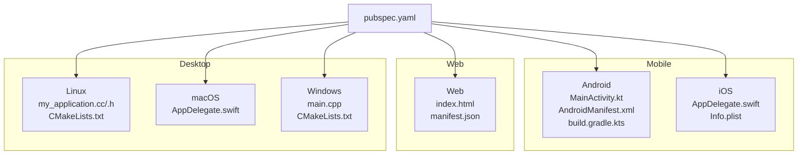
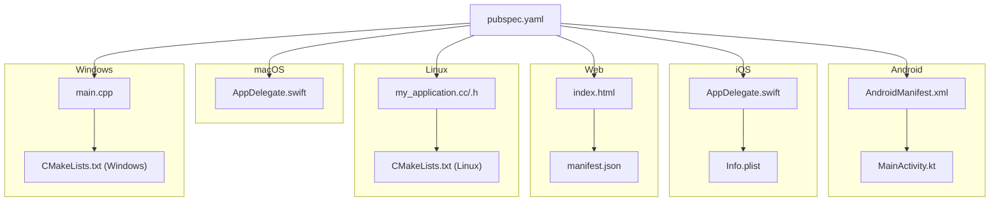
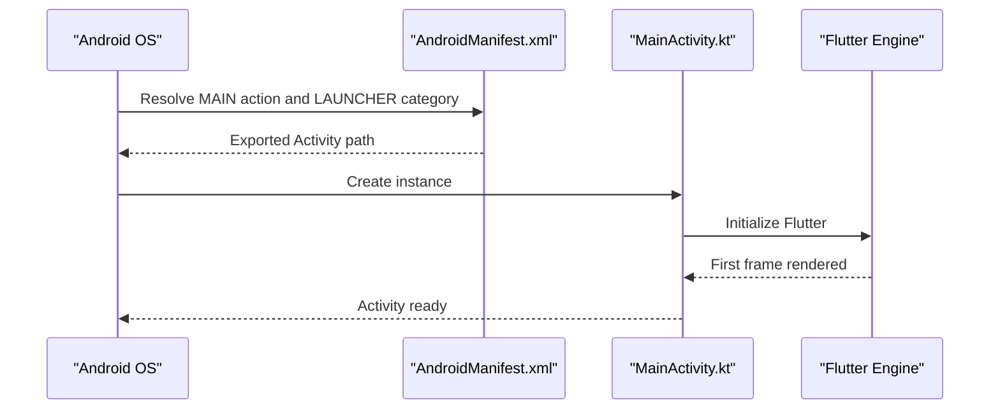
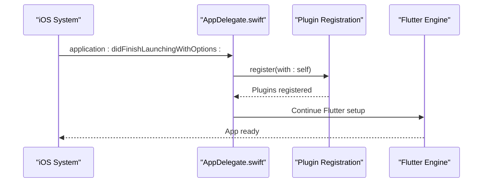
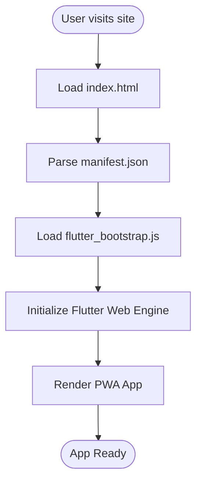
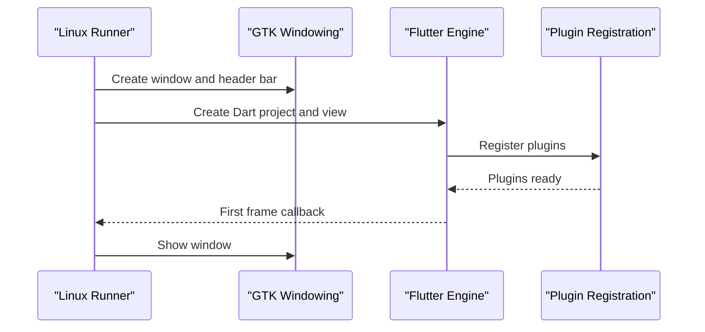
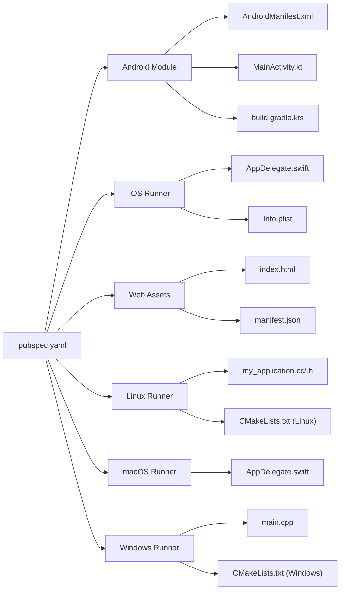

# Platform Integration

<cite>
**Referenced Files in This Document**
- [MainActivity.kt](file://android/app/src/main/kotlin/com/example/asistensia_empleados/MainActivity.kt)
- [AndroidManifest.xml](file://android/app/src/main/AndroidManifest.xml)
- [build.gradle.kts](file://android/app/build.gradle.kts)
- [styles.xml](file://android/app/src/main/res/values/styles.xml)
- [styles.xml (night)](file://android/app/src/main/res/values-night/styles.xml)
- [AppDelegate.swift (iOS)](file://ios/Runner/AppDelegate.swift)
- [Info.plist (iOS)](file://ios/Runner/Info.plist)
- [index.html (web)](file://web/index.html)
- [manifest.json (web)](file://web/manifest.json)
- [CMakeLists.txt (Linux)](file://linux/flutter/CMakeLists.txt)
- [my_application.h (Linux)](file://linux/runner/my_application.h)
- [my_application.cc (Linux)](file://linux/runner/my_application.cc)
- [AppDelegate.swift (macOS)](file://macos/Runner/AppDelegate.swift)
- [CMakeLists.txt (Windows)](file://windows/flutter/CMakeLists.txt)
- [main.cpp (Windows)](file://windows/runner/main.cpp)
- [pubspec.yaml](file://pubspec.yaml)
</cite>

## Table of Contents
1. [Introduction](#introduction)
2. [Project Structure](#project-structure)
3. [Core Components](#core-components)
4. [Architecture Overview](#architecture-overview)
5. [Detailed Component Analysis](#detailed-component-analysis)
6. [Dependency Analysis](#dependency-analysis)
7. [Performance Considerations](#performance-considerations)
8. [Troubleshooting Guide](#troubleshooting-guide)
9. [Conclusion](#conclusion)
10. [Appendices](#appendices)

## Introduction
This document explains how the Flutter employee attendance tracking application integrates with multiple platforms: Android, iOS, Web, Linux, macOS, and Windows. It covers platform-specific setup, build configuration, and runtime initialization patterns. It also outlines cross-platform consistency strategies and how to extend native functionality through platform channels.

## Project Structure
The project follows Flutter’s standard multi-platform layout:
- android/: Android application module with Gradle configuration, Kotlin activity, and Android resources.
- ios/: iOS application with Swift entry point and Xcode workspace metadata.
- web/: Web assets including index.html and PWA manifest.
- linux/, macos/, windows/: Desktop runners with CMake build scripts and platform entry points.

**Diagram sources**
- [pubspec.yaml:1-90](file://pubspec.yaml#L1-L90)
- [MainActivity.kt:1-6](file://android/app/src/main/kotlin/com/example/asistensia_empleados/MainActivity.kt#L1-L6)
- [AndroidManifest.xml:1-46](file://android/app/src/main/AndroidManifest.xml#L1-L46)
- [build.gradle.kts:1-45](file://android/app/build.gradle.kts#L1-L45)
- [AppDelegate.swift (iOS):1-14](file://ios/Runner/AppDelegate.swift#L1-L14)
- [Info.plist (iOS):1-50](file://ios/Runner/Info.plist#L1-L50)
- [index.html (web):1-39](file://web/index.html#L1-L39)
- [manifest.json (web):1-36](file://web/manifest.json#L1-L36)
- [my_application.h (Linux):1-22](file://linux/runner/my_application.h#L1-L22)
- [my_application.cc (Linux):1-149](file://linux/runner/my_application.cc#L1-L149)
- [CMakeLists.txt (Linux):1-89](file://linux/flutter/CMakeLists.txt#L1-L89)
- [AppDelegate.swift (macOS):1-14](file://macos/Runner/AppDelegate.swift#L1-L14)
- [main.cpp (Windows):1-44](file://windows/runner/main.cpp#L1-L44)
- [CMakeLists.txt (Windows):1-110](file://windows/flutter/CMakeLists.txt#L1-L110)

**Section sources**
- [pubspec.yaml:1-90](file://pubspec.yaml#L1-L90)

## Core Components
- Android
  - MainActivity extends FlutterActivity and hosts the Flutter engine.
  - AndroidManifest declares the main Activity, theme metadata, and queries for text processing.
  - Gradle script configures SDK versions, Java/Kotlin compatibility, signing, and Flutter source path.
  - Values and values-night themes define light/dark launch and normal themes.
- iOS
  - AppDelegate registers plugins and defers lifecycle to FlutterAppDelegate.
  - Info.plist defines bundle identifiers, supported orientations, and app metadata.
- Web
  - index.html sets base href, Apple touch icons, favicon, and links to the PWA manifest.
  - manifest.json defines app identity, display mode, orientation, and icon assets.
- Linux/macOS
  - Linux runner creates a GTK window, registers plugins, and manages the Flutter view lifecycle.
  - macOS AppDelegate configures termination and secure restoration behavior.
  - Linux CMake builds the Flutter engine and exposes headers and libraries.
- Windows
  - Windows runner initializes COM, sets up a Flutter window, and runs the message loop.
  - Windows CMake builds the Flutter engine and wrapper libraries.

**Section sources**
- [MainActivity.kt:1-6](file://android/app/src/main/kotlin/com/example/asistensia_empleados/MainActivity.kt#L1-L6)
- [AndroidManifest.xml:1-46](file://android/app/src/main/AndroidManifest.xml#L1-L46)
- [build.gradle.kts:1-45](file://android/app/build.gradle.kts#L1-L45)
- [styles.xml:1-19](file://android/app/src/main/res/values/styles.xml#L1-L19)
- [styles.xml (night):1-19](file://android/app/src/main/res/values-night/styles.xml#L1-L19)
- [AppDelegate.swift (iOS):1-14](file://ios/Runner/AppDelegate.swift#L1-L14)
- [Info.plist (iOS):1-50](file://ios/Runner/Info.plist#L1-L50)
- [index.html (web):1-39](file://web/index.html#L1-L39)
- [manifest.json (web):1-36](file://web/manifest.json#L1-L36)
- [my_application.h (Linux):1-22](file://linux/runner/my_application.h#L1-L22)
- [my_application.cc (Linux):1-149](file://linux/runner/my_application.cc#L1-L149)
- [CMakeLists.txt (Linux):1-89](file://linux/flutter/CMakeLists.txt#L1-L89)
- [AppDelegate.swift (macOS):1-14](file://macos/Runner/AppDelegate.swift#L1-L14)
- [main.cpp (Windows):1-44](file://windows/runner/main.cpp#L1-L44)
- [CMakeLists.txt (Windows):1-110](file://windows/flutter/CMakeLists.txt#L1-L110)

## Architecture Overview
The application initializes the Flutter engine per platform. On mobile, the OS launches the app entry point (Activity or AppDelegate), which registers plugins and starts the engine. On web, the browser loads index.html and manifest.json to bootstrap the PWA. On desktop, platform-specific runners create windows, configure Flutter projects, and manage the event loop.

**Diagram sources**
- [AndroidManifest.xml:1-46](file://android/app/src/main/AndroidManifest.xml#L1-L46)
- [MainActivity.kt:1-6](file://android/app/src/main/kotlin/com/example/asistensia_empleados/MainActivity.kt#L1-L6)
- [AppDelegate.swift (iOS):1-14](file://ios/Runner/AppDelegate.swift#L1-L14)
- [Info.plist (iOS):1-50](file://ios/Runner/Info.plist#L1-L50)
- [index.html (web):1-39](file://web/index.html#L1-L39)
- [manifest.json (web):1-36](file://web/manifest.json#L1-L36)
- [my_application.h (Linux):1-22](file://linux/runner/my_application.h#L1-L22)
- [my_application.cc (Linux):1-149](file://linux/runner/my_application.cc#L1-L149)
- [CMakeLists.txt (Linux):1-89](file://linux/flutter/CMakeLists.txt#L1-L89)
- [AppDelegate.swift (macOS):1-14](file://macos/Runner/AppDelegate.swift#L1-L14)
- [main.cpp (Windows):1-44](file://windows/runner/main.cpp#L1-L44)
- [CMakeLists.txt (Windows):1-110](file://windows/flutter/CMakeLists.txt#L1-L110)
- [pubspec.yaml:1-90](file://pubspec.yaml#L1-L90)

## Detailed Component Analysis

### Android Integration
- MainActivity
  - Extends FlutterActivity to embed the Flutter engine into the Android app.
- AndroidManifest
  - Declares the main Activity, exported flag, launch mode, hardware acceleration, and configuration changes.
  - Provides NormalTheme metadata and declares queries for text processing.
- Gradle (build.gradle.kts)
  - Applies Android, Kotlin, and Flutter Gradle plugins in the correct order.
  - Sets namespace, compile/target SDK, Java/Kotlin compatibility, applicationId, min/target SDK, version code/name, and release signing config.
  - Points Flutter source to the project root.
- Themes
  - Light and dark theme resources define launch and normal themes for day/night modes.

**Diagram sources**
- [AndroidManifest.xml:6-27](file://android/app/src/main/AndroidManifest.xml#L6-L27)
- [MainActivity.kt:1-6](file://android/app/src/main/kotlin/com/example/asistensia_empleados/MainActivity.kt#L1-L6)

**Section sources**
- [MainActivity.kt:1-6](file://android/app/src/main/kotlin/com/example/asistensia_empleados/MainActivity.kt#L1-L6)
- [AndroidManifest.xml:1-46](file://android/app/src/main/AndroidManifest.xml#L1-L46)
- [build.gradle.kts:1-45](file://android/app/build.gradle.kts#L1-L45)
- [styles.xml:1-19](file://android/app/src/main/res/values/styles.xml#L1-L19)
- [styles.xml (night):1-19](file://android/app/src/main/res/values-night/styles.xml#L1-L19)

### iOS Integration
- AppDelegate
  - Subclasses FlutterAppDelegate and registers plugins during application launch.
- Info.plist
  - Defines bundle identifiers, display name, supported orientations (including iPad), and enables indirect input events.

**Diagram sources**
- [AppDelegate.swift (iOS):4-12](file://ios/Runner/AppDelegate.swift#L4-L12)
- [Info.plist (iOS):25-47](file://ios/Runner/Info.plist#L25-L47)

**Section sources**
- [AppDelegate.swift (iOS):1-14](file://ios/Runner/AppDelegate.swift#L1-L14)
- [Info.plist (iOS):1-50](file://ios/Runner/Info.plist#L1-L50)

### Web Platform Deployment
- index.html
  - Sets base href for routing, includes Apple touch icons, favicon, and links to manifest.json.
  - Loads flutter_bootstrap.js to initialize the web engine.
- manifest.json
  - Defines app name, short name, start URL, standalone display, theme/background colors, orientation, and icon assets.

**Diagram sources**
- [index.html (web):17-36](file://web/index.html#L17-L36)
- [manifest.json (web):1-36](file://web/manifest.json#L1-L36)

**Section sources**
- [index.html (web):1-39](file://web/index.html#L1-L39)
- [manifest.json (web):1-36](file://web/manifest.json#L1-L36)

### Desktop Platforms (Linux, macOS, Windows)
- Linux
  - my_application.cc creates a GTK window, sets title bar behavior, registers the Flutter view, and shows the window upon the first frame.
  - CMake fetches GTK/GLib/GIO, links Flutter libraries, and orchestrates the Flutter tool backend.
- macOS
  - AppDelegate configures termination behavior and secure restoration support.
- Windows
  - main.cpp initializes COM, creates a Flutter window, and runs the message loop.
  - CMake builds the Flutter engine and wrapper libraries for plugin/app integration.

**Diagram sources**
- [my_application.cc:23-79](file://linux/runner/my_application.cc#L23-L79)
- [CMakeLists.txt (Linux):24-69](file://linux/flutter/CMakeLists.txt#L24-L69)

**Section sources**
- [my_application.h (Linux):1-22](file://linux/runner/my_application.h#L1-L22)
- [my_application.cc (Linux):1-149](file://linux/runner/my_application.cc#L1-L149)
- [CMakeLists.txt (Linux):1-89](file://linux/flutter/CMakeLists.txt#L1-L89)
- [AppDelegate.swift (macOS):1-14](file://macos/Runner/AppDelegate.swift#L1-L14)
- [main.cpp (Windows):1-44](file://windows/runner/main.cpp#L1-L44)
- [CMakeLists.txt (Windows):1-110](file://windows/flutter/CMakeLists.txt#L1-L110)

## Dependency Analysis
- Android
  - MainActivity depends on FlutterActivity; AndroidManifest declares the Activity and metadata; Gradle ties the module to Flutter tooling.
- iOS
  - AppDelegate depends on FlutterAppDelegate and plugin registration; Info.plist provides bundle metadata.
- Web
  - index.html depends on manifest.json; both are consumed by the browser to bootstrap the PWA.
- Desktop
  - Linux/macOS depend on platform frameworks (GTK/Cocoa); Windows depends on Win32 APIs and COM.
- Cross-platform
  - pubspec.yaml defines the Flutter SDK and application metadata used across platforms.

**Diagram sources**
- [pubspec.yaml:1-90](file://pubspec.yaml#L1-L90)
- [AndroidManifest.xml:1-46](file://android/app/src/main/AndroidManifest.xml#L1-L46)
- [MainActivity.kt:1-6](file://android/app/src/main/kotlin/com/example/asistensia_empleados/MainActivity.kt#L1-L6)
- [build.gradle.kts:1-45](file://android/app/build.gradle.kts#L1-L45)
- [AppDelegate.swift (iOS):1-14](file://ios/Runner/AppDelegate.swift#L1-L14)
- [Info.plist (iOS):1-50](file://ios/Runner/Info.plist#L1-L50)
- [index.html (web):1-39](file://web/index.html#L1-L39)
- [manifest.json (web):1-36](file://web/manifest.json#L1-L36)
- [my_application.h (Linux):1-22](file://linux/runner/my_application.h#L1-L22)
- [my_application.cc (Linux):1-149](file://linux/runner/my_application.cc#L1-L149)
- [CMakeLists.txt (Linux):1-89](file://linux/flutter/CMakeLists.txt#L1-L89)
- [AppDelegate.swift (macOS):1-14](file://macos/Runner/AppDelegate.swift#L1-L14)
- [main.cpp (Windows):1-44](file://windows/runner/main.cpp#L1-L44)
- [CMakeLists.txt (Windows):1-110](file://windows/flutter/CMakeLists.txt#L1-L110)

**Section sources**
- [pubspec.yaml:1-90](file://pubspec.yaml#L1-L90)

## Performance Considerations
- Android
  - Hardware acceleration is enabled; ensure graphics-intensive UI remains responsive by avoiding heavy work on the main thread.
  - Keep configuration changes minimal to reduce unnecessary restarts.
- iOS
  - Respect supported orientations and enable indirect input events for modern input handling.
- Web
  - Use a PWA manifest to cache assets and improve offline readiness; keep base href aligned with hosting path.
- Desktop
  - Linux: Prefer GTK header bars on GNOME; otherwise fall back to title bars for compatibility.
  - Windows: Initialize COM once and avoid blocking the UI thread in the message loop.

[No sources needed since this section provides general guidance]

## Troubleshooting Guide
- Android
  - If the app fails to start, verify the Activity export flag and intent filters in the manifest.
  - Ensure Gradle Java/Kotlin targets match the configured compile SDK.
- iOS
  - If plugins fail to register, confirm AppDelegate overrides the launch method and calls plugin registration.
  - Validate Info.plist keys for supported orientations and bundle identifiers.
- Web
  - If the PWA icons or theme color do not appear, check manifest.json paths and colors.
  - Confirm index.html links to manifest.json and base href alignment.
- Desktop
  - Linux: If the window does not appear, ensure the first-frame callback shows the toplevel widget.
  - Windows: If the app exits immediately, verify window creation and message loop logic.

**Section sources**
- [AndroidManifest.xml:6-27](file://android/app/src/main/AndroidManifest.xml#L6-L27)
- [build.gradle.kts:13-20](file://android/app/build.gradle.kts#L13-L20)
- [AppDelegate.swift (iOS):6-12](file://ios/Runner/AppDelegate.swift#L6-L12)
- [Info.plist (iOS):25-47](file://ios/Runner/Info.plist#L25-L47)
- [index.html (web):17-36](file://web/index.html#L17-L36)
- [manifest.json (web):1-36](file://web/manifest.json#L1-L36)
- [my_application.cc:18-20](file://linux/runner/my_application.cc#L18-L20)
- [main.cpp:29-39](file://windows/runner/main.cpp#L29-L39)

## Conclusion
The application integrates consistently across platforms by delegating to platform-specific entry points and build systems while sharing Flutter logic and assets. Android and iOS rely on their native lifecycles and plugin registration; Web uses index.html and manifest.json for bootstrapping; Desktop platforms use native windowing systems with CMake-managed Flutter engines. Following the outlined configurations ensures reliable builds and runtime behavior.

[No sources needed since this section summarizes without analyzing specific files]

## Appendices
- Cross-platform consistency tips
  - Keep platform entry points minimal and delegate to shared Flutter code.
  - Use platform channels sparingly and document message codecs and threading expectations.
  - Align versioning and build metadata across platforms using pubspec.yaml and platform manifests.

[No sources needed since this section provides general guidance]