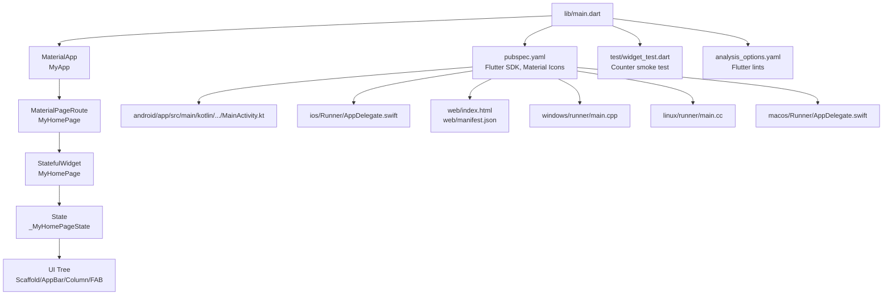
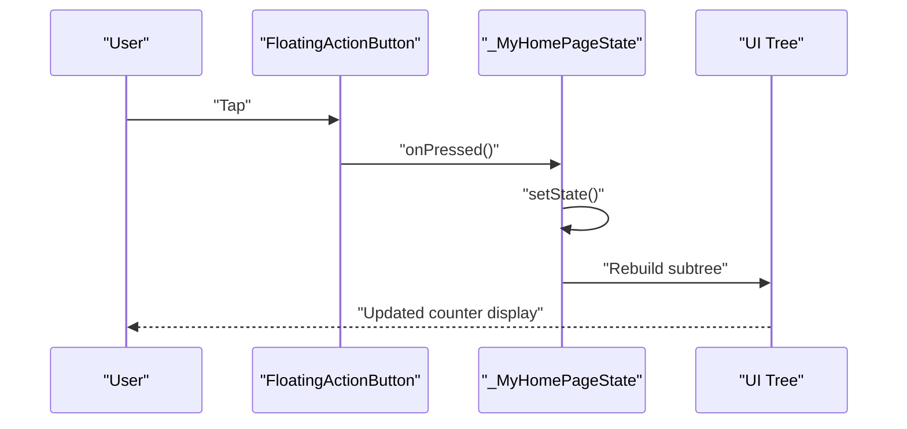
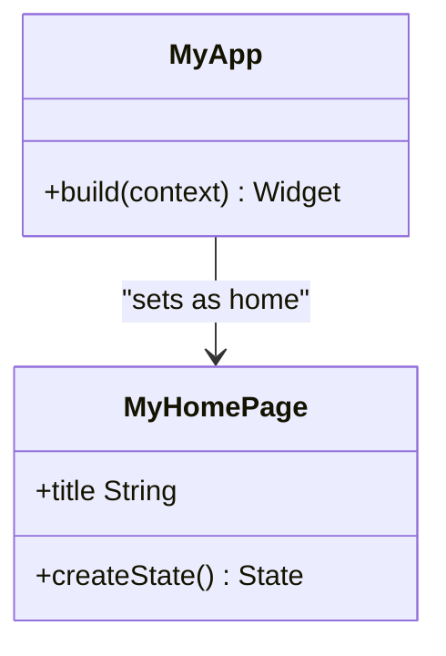
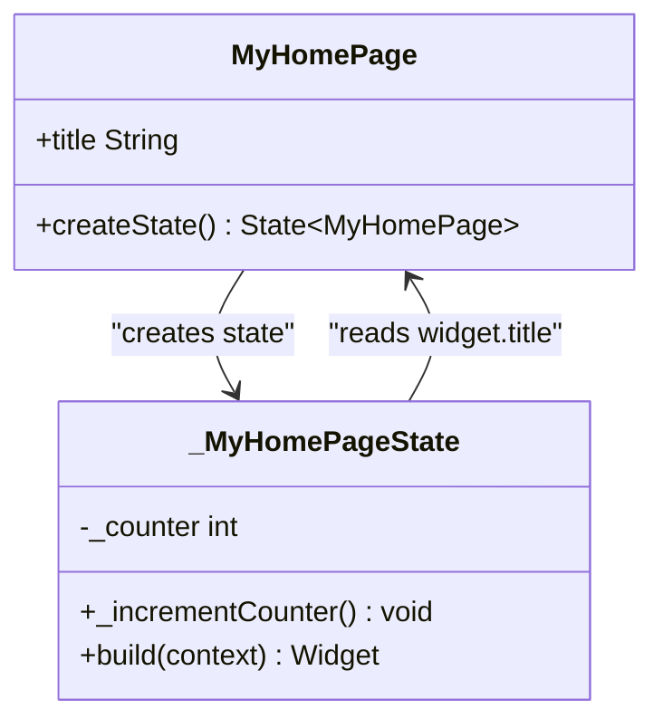
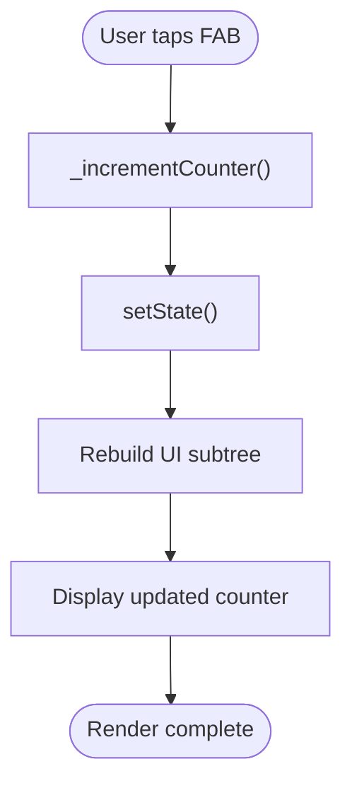
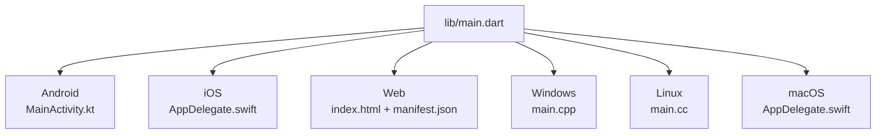
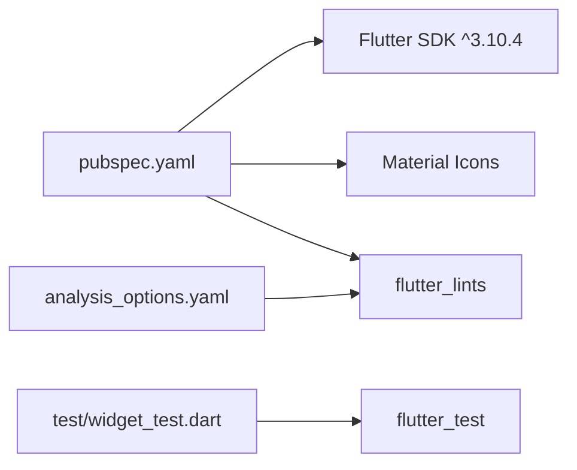

# Project Overview

<cite>
**Referenced Files in This Document**
- [main.dart](file://lib/main.dart)
- [pubspec.yaml](file://pubspec.yaml)
- [README.md](file://README.md)
- [widget_test.dart](file://test/widget_test.dart)
- [analysis_options.yaml](file://analysis_options.yaml)
- [MainActivity.kt](file://android/app/src/main/kotlin/com/example/asistensia_empleados/MainActivity.kt)
- [AppDelegate.swift (iOS)](file://ios/Runner/AppDelegate.swift)
- [index.html](file://web/index.html)
- [manifest.json](file://web/manifest.json)
- [main.cc (Linux)](file://linux/runner/main.cc)
- [main.cpp (Windows)](file://windows/runner/main.cpp)
- [AppDelegate.swift (macOS)](file://macos/Runner/AppDelegate.swift)
</cite>

## Table of Contents
1. [Introduction](#introduction)
2. [Project Structure](#project-structure)
3. [Core Components](#core-components)
4. [Architecture Overview](#architecture-overview)
5. [Detailed Component Analysis](#detailed-component-analysis)
6. [Dependency Analysis](#dependency-analysis)
7. [Performance Considerations](#performance-considerations)
8. [Troubleshooting Guide](#troubleshooting-guide)
9. [Conclusion](#conclusion)
10. [Appendices](#appendices)

## Introduction
This Flutter-based application serves as a cross-platform foundation for an employee attendance tracking system. It demonstrates Flutter’s capabilities to deliver a unified UI across Android, iOS, Web, Desktop (Windows, Linux, macOS), while leveraging Material Design components and reactive state management. The project currently implements a counter-based UI pattern to illustrate core Flutter concepts such as Stateless and Stateful widgets, the build lifecycle, and setState-driven updates. These patterns are directly applicable to building real-world features like check-in/check-out buttons and attendance summaries.

The application is scaffolded as a starting point, with clear separation of concerns and multi-platform support configured out-of-the-box. Beginners can learn Flutter fundamentals through the counter example, while experienced developers can extend the pattern to implement attendance logic, data persistence, and navigation flows.

## Project Structure
At a high level, the project follows Flutter conventions:
- lib/main.dart: Application entry point and UI scaffolding
- pubspec.yaml: Package metadata, dependencies, and Flutter-specific assets/fonts
- Platform integrations: android/, ios/, web/, windows/, linux/, macos/
- Tests: test/widget_test.dart
- Linting and analysis: analysis_options.yaml
- README.md: Getting started guidance

**Diagram sources**
- [main.dart:3-36](file://lib/main.dart#L3-L36)
- [pubspec.yaml:30-58](file://pubspec.yaml#L30-L58)
- [MainActivity.kt:1-6](file://android/app/src/main/kotlin/com/example/asistensia_empleados/MainActivity.kt#L1-L6)
- [AppDelegate.swift (iOS):4-13](file://ios/Runner/AppDelegate.swift#L4-L13)
- [index.html:1-39](file://web/index.html#L1-L39)
- [manifest.json:1-36](file://web/manifest.json#L1-L36)
- [main.cpp (Windows):1-44](file://windows/runner/main.cpp#L1-L44)
- [main.cc (Linux):1-7](file://linux/runner/main.cc#L1-L7)
- [AppDelegate.swift (macOS):4-13](file://macos/Runner/AppDelegate.swift#L4-L13)

**Section sources**
- [main.dart:1-123](file://lib/main.dart#L1-L123)
- [pubspec.yaml:1-90](file://pubspec.yaml#L1-L90)
- [README.md:1-17](file://README.md#L1-L17)

## Core Components
- Application bootstrap: The app starts at main(), which runs MyApp. MyApp is a StatelessWidget that configures the app theme and sets the home route to MyHomePage.
- Home page: MyHomePage is a StatefulWidget containing a counter field and an increment handler. The state is managed inside _MyHomePageState, which rebuilds the UI reactively upon state changes.
- UI composition: The build method constructs a Scaffold with an AppBar, a centered column displaying the counter, and a FloatingActionButton that triggers the increment action.
- Testing: A widget test verifies the counter increments correctly, demonstrating Flutter’s testing utilities and the counter pattern.

Practical example references:
- Counter state and increment: [main.dart:56-68](file://lib/main.dart#L56-L68)
- UI rendering and FAB binding: [main.dart:70-121](file://lib/main.dart#L70-L121)
- Test verifying counter behavior: [widget_test.dart:14-29](file://test/widget_test.dart#L14-L29)

**Section sources**
- [main.dart:3-123](file://lib/main.dart#L3-L123)
- [widget_test.dart:1-31](file://test/widget_test.dart#L1-L31)

## Architecture Overview
The application follows Flutter’s declarative paradigm:
- Stateless widgets (MyApp) define immutable configuration and pass data down to child widgets.
- Stateful widgets (MyHomePage) encapsulate mutable state and expose setState to trigger rebuilds.
- The framework rebuilds only the affected parts of the widget tree, optimizing performance.

**Diagram sources**
- [main.dart:56-121](file://lib/main.dart#L56-L121)

**Section sources**
- [main.dart:38-123](file://lib/main.dart#L38-L123)

## Detailed Component Analysis

### MyApp (Stateless)
- Purpose: Root widget configuring the app theme and routing.
- Key responsibilities:
  - Define theme color scheme derived from a seed color.
  - Set the home route to MyHomePage.
- Flutter concepts demonstrated:
  - Stateless widget composition.
  - Theme usage via Theme.of(context).

References:
- [main.dart:7-36](file://lib/main.dart#L7-L36)

**Diagram sources**
- [main.dart:7-36](file://lib/main.dart#L7-L36)

**Section sources**
- [main.dart:7-36](file://lib/main.dart#L7-L36)

### MyHomePage (StatefulWidget) and _MyHomePageState
- Purpose: Demonstrates the counter-based UI pattern and reactive state management.
- Key responsibilities:
  - Hold mutable state (_counter).
  - Provide an increment handler (_incrementCounter) that calls setState.
  - Rebuild the UI in response to state changes.
- UI structure:
  - Scaffold with AppBar and body containing a centered column.
  - Text label and a dynamic counter value.
  - FloatingActionButton bound to the increment handler.

References:
- [main.dart:38-54](file://lib/main.dart#L38-L54)
- [main.dart:56-68](file://lib/main.dart#L56-L68)
- [main.dart:70-121](file://lib/main.dart#L70-L121)

**Diagram sources**
- [main.dart:38-121](file://lib/main.dart#L38-L121)

**Section sources**
- [main.dart:38-123](file://lib/main.dart#L38-L123)

### Counter Pattern and State Management
- Pattern: Increment a counter and display it, triggered by a FAB.
- State management:
  - setState schedules a rebuild of the widget subtree.
  - The build method reads current state and renders the UI accordingly.
- Practical extension ideas:
  - Replace the counter with “Check-In” and “Check-Out” actions.
  - Store timestamps and statuses in state.
  - Integrate with a backend service for attendance records.

References:
- [main.dart:56-68](file://lib/main.dart#L56-L68)
- [main.dart:70-121](file://lib/main.dart#L70-L121)
- [widget_test.dart:14-29](file://test/widget_test.dart#L14-L29)

**Diagram sources**
- [main.dart:56-121](file://lib/main.dart#L56-L121)

**Section sources**
- [main.dart:56-121](file://lib/main.dart#L56-L121)
- [widget_test.dart:14-29](file://test/widget_test.dart#L14-L29)

### Multi-Platform Support
- Android: MainActivity extends FlutterActivity, enabling Flutter engine integration.
- iOS: AppDelegate registers plugins and initializes the Flutter engine.
- Web: index.html hosts the Flutter web bootstrap script and PWA manifest.
- Desktop:
  - Windows: main.cpp creates a FlutterWindow and enters the message loop.
  - Linux: main.cc launches the application via a GLib-based entry point.
  - macOS: AppDelegate manages lifecycle and secure restoration.

References:
- [MainActivity.kt:1-6](file://android/app/src/main/kotlin/com/example/asistensia_empleados/MainActivity.kt#L1-L6)
- [AppDelegate.swift (iOS):4-13](file://ios/Runner/AppDelegate.swift#L4-L13)
- [index.html:1-39](file://web/index.html#L1-L39)
- [manifest.json:1-36](file://web/manifest.json#L1-L36)
- [main.cpp (Windows):1-44](file://windows/runner/main.cpp#L1-L44)
- [main.cc (Linux):1-7](file://linux/runner/main.cc#L1-L7)
- [AppDelegate.swift (macOS):4-13](file://macos/Runner/AppDelegate.swift#L4-L13)

**Diagram sources**
- [MainActivity.kt:1-6](file://android/app/src/main/kotlin/com/example/asistensia_empleados/MainActivity.kt#L1-L6)
- [AppDelegate.swift (iOS):4-13](file://ios/Runner/AppDelegate.swift#L4-L13)
- [index.html:1-39](file://web/index.html#L1-L39)
- [manifest.json:1-36](file://web/manifest.json#L1-L36)
- [main.cpp (Windows):1-44](file://windows/runner/main.cpp#L1-L44)
- [main.cc (Linux):1-7](file://linux/runner/main.cc#L1-L7)
- [AppDelegate.swift (macOS):4-13](file://macos/Runner/AppDelegate.swift#L4-L13)

**Section sources**
- [MainActivity.kt:1-6](file://android/app/src/main/kotlin/com/example/asistensia_empleados/MainActivity.kt#L1-L6)
- [AppDelegate.swift (iOS):4-13](file://ios/Runner/AppDelegate.swift#L4-L13)
- [index.html:1-39](file://web/index.html#L1-L39)
- [manifest.json:1-36](file://web/manifest.json#L1-L36)
- [main.cpp (Windows):1-44](file://windows/runner/main.cpp#L1-L44)
- [main.cc (Linux):1-7](file://linux/runner/main.cc#L1-L7)
- [AppDelegate.swift (macOS):4-13](file://macos/Runner/AppDelegate.swift#L4-L13)

## Dependency Analysis
- Flutter SDK: Declared in pubspec.yaml with a compatible SDK constraint.
- Material Icons: Enabled via uses-material-design to support Material components.
- Linting: Flutter lints are included and configured in analysis_options.yaml.
- Testing: flutter_test is declared for widget testing.

**Diagram sources**
- [pubspec.yaml:21-58](file://pubspec.yaml#L21-L58)
- [analysis_options.yaml:8-10](file://analysis_options.yaml#L8-L10)
- [widget_test.dart:8-11](file://test/widget_test.dart#L8-L11)

**Section sources**
- [pubspec.yaml:21-58](file://pubspec.yaml#L21-L58)
- [analysis_options.yaml:8-10](file://analysis_options.yaml#L8-L10)
- [widget_test.dart:8-11](file://test/widget_test.dart#L8-L11)

## Performance Considerations
- Rebuild scope: setState triggers a rebuild of the nearest StatefulWidget subtree, minimizing unnecessary work.
- Layout optimization: Using Center and Column helps keep the UI predictable and efficient.
- Platform-specific optimizations: Desktop and Web targets benefit from Flutter’s compiled engine; ensure assets and fonts are optimized for distribution.

[No sources needed since this section provides general guidance]

## Troubleshooting Guide
- Counter test fails: Verify the test taps the FAB and checks for the expected text after pump(). Reference: [widget_test.dart:14-29](file://test/widget_test.dart#L14-L29)
- Hot reload resets state expectations: Remember that hot reload preserves application state; use hot restart to reset if needed. Reference: [main.dart:19-27](file://lib/main.dart#L19-L27)
- Lint warnings: Customize rules in analysis_options.yaml or suppress selectively. Reference: [analysis_options.yaml:12-26](file://analysis_options.yaml#L12-L26)

**Section sources**
- [widget_test.dart:14-29](file://test/widget_test.dart#L14-L29)
- [main.dart:19-27](file://lib/main.dart#L19-L27)
- [analysis_options.yaml:12-26](file://analysis_options.yaml#L12-L26)

## Conclusion
This project establishes a solid foundation for a cross-platform employee attendance application using Flutter. The counter-based UI pattern clearly illustrates Flutter’s reactive state model, while the multi-platform setup enables deployment to Android, iOS, Web, and Desktop. Developers can extend the existing StatefulWidget pattern to implement attendance features such as check-in/check-out actions, status tracking, and data persistence, all while maintaining a consistent Material Design experience.

[No sources needed since this section summarizes without analyzing specific files]

## Appendices
- Getting started resources: [README.md:9-16](file://README.md#L9-L16)
- Example references:
  - Counter increment handler: [main.dart:56-68](file://lib/main.dart#L56-L68)
  - UI rendering and FAB binding: [main.dart:70-121](file://lib/main.dart#L70-L121)
  - Counter smoke test: [widget_test.dart:14-29](file://test/widget_test.dart#L14-L29)

**Section sources**
- [README.md:9-16](file://README.md#L9-L16)
- [main.dart:56-121](file://lib/main.dart#L56-L121)
- [widget_test.dart:14-29](file://test/widget_test.dart#L14-L29)